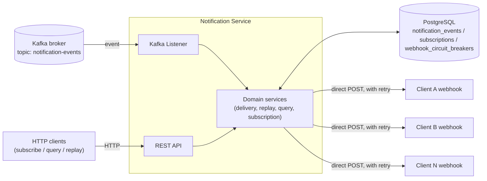
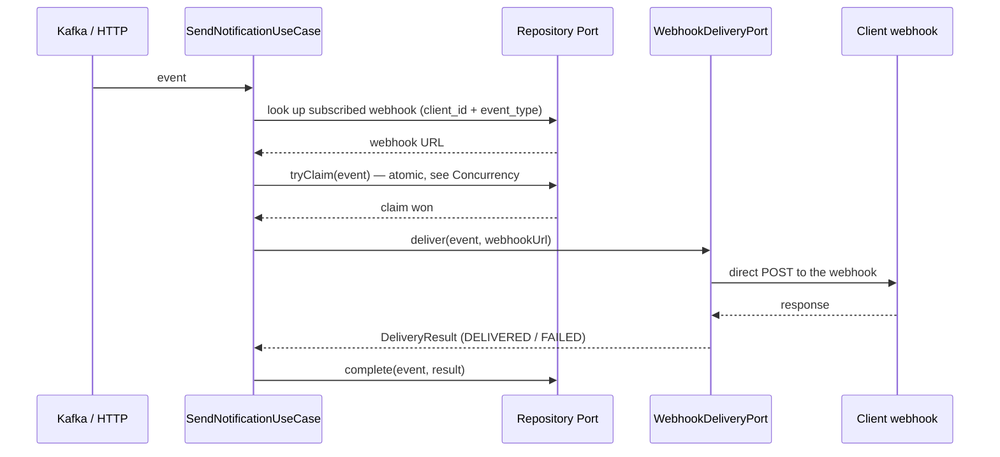

# cobre-challenge — Notification Service

## Stack

- **Java 27** (toolchain pinned in `build.gradle`)
- **Gradle 9.7.1** (via wrapper, `./gradlew`)
- **Spring Boot 4.1.1**, PostgreSQL + Flyway, Spring Kafka, Resilience4j (retry), Datadog (DogStatsD), SpringDoc OpenAPI
- **Virtual threads** (`spring.threads.virtual.enabled=true`): all of this service's I/O is blocking (RestClient, JPA, the servlet container) — nothing reactive. Virtual threads let that blocking I/O scale (many connections waiting on a response at once: DB, Kafka, clients' webhooks) without needing a reactive stack or hand-tuning thread pools.

## Description

A service that consumes events generated by the platform (via Kafka, or via HTTP for testing), deduplicates them, looks up whether the client has a webhook subscribed to that event type, delivers the event by calling the client's webhook directly over HTTPS, and persists the outcome of each attempt. It also exposes a self-service API to query a client's event history and retry (`replay`) the ones that failed.

Hexagonal architecture: the domain (`domain/`) knows nothing about Kafka, HTTP, Postgres or Datadog — it only defines ports (`port/in`, `port/out`) that the adapters (`adapter/in`, `adapter/out`) implement.

## Architecture



- **Kafka**: the main source of events (`notification.events.topic`). The listener and the `POST /notification_events` endpoint feed the same use case.
- **PostgreSQL**: `notification_events` (the final outcome of each processed event, one row per `client_id + event_id` — also the piece that makes deduplication and concurrency control atomic, see [Concurrency and race conditions](#concurrency-and-race-conditions)), `subscriptions` (the active webhook per `user_id + event_type`) and `webhook_circuit_breakers` (**that webhook's score and circuit breaker state**, one row per `(client_id, web_hook_url)` — see [Subscriptions and webhooks](#subscriptions-and-webhooks)).
- **Client webhook**: the service hits it directly over HTTPS (with retry, `WebhookHttpClient`) — there's no intermediary. The circuit breaker lives per webhook, in `webhook_circuit_breakers` (see [Subscriptions and webhooks](#subscriptions-and-webhooks)), so one client's broken webhook doesn't block delivery to the rest.

## Main flow

Happy path for an event (Kafka or `POST /notification_events`): look up the subscribed webhook, deliver the notification, and persist the outcome.



`Repository Port` groups the domain's two persistence ports — `SubscriptionPort` (looks up the webhook) and `NotificationRecordPort` (the atomic claim and the final outcome) — both are the same kind of port: the interface for reading/writing wherever the data actually lives, without the domain knowing it's PostgreSQL today.

Before this path, the service short-circuits early if there's no subscribed webhook (`NOT_SUBSCRIBED`, without touching the database) or if it loses the atomic claim (`DUPLICATE` — see [Concurrency and race conditions](#concurrency-and-race-conditions), which is also where idempotency lives today); once the claim is won, if that webhook's circuit breaker is open it short-circuits there too (`CIRCUIT_OPEN`) without calling the webhook. See [Subscriptions and webhooks](#subscriptions-and-webhooks) and [Self-service API](#self-service-api-querying-and-retrying-events) for `replay`.

## Idempotency and resilience

### Idempotency

The source of truth is the same atomic database claim that resolves race conditions (see [Concurrency and race conditions](#concurrency-and-race-conditions)): `event_id` is unique platform-wide, and once an event is `DELIVERED`, no later attempt (a Kafka redelivery, a resend from the platform) calls the webhook again — `NotificationRecordPort#tryClaim` rejects it directly against the persisted row, indefinitely, with no TTL.

In front of that sits an `IdempotencyPort`, a **best-effort** cache (`isDuplicate` / `markAsProcessed`) that skips the round trip to Postgres for the obvious case — an event we already know was delivered. It isn't a second source of truth: a miss simply falls through to the Postgres claim, which is what actually decides. The implementation changes per profile:

- **`local`**: `InMemoryIdempotencyCache`, a `ConcurrentHashMap` with a TTL — no need to run Redis to run the app locally.
- **Any other profile**: `RedisIdempotencyCache`, a `SET key EX ttl` / `GET` against Redis.

Redis in production isn't about correctness — the Postgres claim is already correct no matter how many instances of the service run at once, because they all share the same database. It's about **cost**: without a cache shared across nodes, each instance only remembers the events it processed itself, so a duplicate that lands on a different instance than the one that delivered the original has no way to avoid the round trip to Postgres (which is now a write — `tryClaim`'s `INSERT ... ON CONFLICT` — not a free read). Redis, being shared across nodes, filters that case out too, so that write to Postgres never happens.

| Property | What it configures |
|---|---|
| `idempotency.ttl` | How long an already-delivered `event_id` is remembered in the cache (Redis or the local map) before falling back to the Postgres claim again. Doesn't affect correctness — only how many duplicates get filtered before touching the database. |
| `spring.data.redis.host` / `spring.data.redis.port` | Connection to the shared Redis (ignored in the `local` profile, which doesn't use it). |

### Retry

`WebhookHttpClient` wraps every direct call to the client's webhook with retry (Resilience4j), to absorb transient failures (5xx, timeout, connection error) without manual intervention. A 4xx rejection is **not** retried. Each attempt — the original and every retry — is recorded separately against the [webhook's score](#score-and-circuit-breaker-per-webhook), not just the final outcome.

Only a **2xx** counts as a successful delivery — it's checked explicitly (`response.getStatusCode().is2xxSuccessful()`); "didn't throw an exception" isn't enough: `RestClient` only throws for 4xx/5xx by default, so a 3xx (redirect) would reach that point too and, without the check, would have been stored as `DELIVERED` without the webhook actually having accepted the event. Redirects also aren't followed automatically (`HttpURLConnection.setInstanceFollowRedirects(false)` via `prepareConnection`) — so `WebhookHttpClient` always sees the real response from the registered URL, not from wherever that URL redirects to (which could be a different host, or a downgrade from `https` to `http`). A 3xx is treated the same as a 4xx: a rejection, not retryable — hitting the same URL again would give the same redirect.

| Property | What it configures |
|---|---|
| `notification.webhook.delivery.connect-timeout` | Timeout for establishing the TCP connection to the webhook. |
| `notification.webhook.delivery.read-timeout` | Timeout for reading the response once connected. |
| `notification.webhook.delivery.retry.max-attempts` | Maximum number of attempts (including the first) on transient failures. |
| `notification.webhook.delivery.retry.wait-duration` | Base wait between retries. |
| `notification.webhook.delivery.retry.exponential-backoff-multiplier` | Multiplier applied to `wait-duration` on each successive attempt (with 200ms and multiplier 2.0: 200ms, 400ms, 800ms...). |

An event whose delivery definitively fails (retries exhausted, or that webhook's circuit breaker open — see [Subscriptions and webhooks](#subscriptions-and-webhooks)) is recorded (`delivery_status=FAILED` or `CIRCUIT_OPEN`) and can be explicitly retried via `POST /notification_events/{id}/replay` — see [Self-service API](#self-service-api-querying-and-retrying-events).

## Concurrency and race conditions

Before, "has this event already been processed?" and "mark it as processed" were two separate steps — check, deliver, only then persist. Anything that interleaved between those steps (two concurrent requests for the same event, a replay running twice, a crash right after calling the webhook) left an inconsistent state: double delivery, or a successful delivery the system never got to record. Neither problem is fixed by reordering those steps — deciding who processes an event needs to **be, itself, an atomic and durable operation**, not a sequence of steps someone can interrupt midway.

### The mechanism: reserve the row before calling the webhook, not after

`NotificationRecordPort#tryClaim` (for new events, via HTTP or Kafka) and `#tryClaimForReplay` (for `POST .../replay`) are each **a single SQL statement** against `notification_events`:

- `tryClaim`: `INSERT ... ON CONFLICT (client_id, event_id) DO UPDATE ... WHERE delivery_status IN ('FAILED', 'CIRCUIT_OPEN')`. Inserts the row as `PROCESSING` the first time, or puts it back into `PROCESSING` if it last ended in a legitimately retryable state — any other case (already `DELIVERED`, or someone else is processing it right now) doesn't match the `WHERE`, the conflict isn't resolved, and the statement reports 0 affected rows.
- `tryClaimForReplay`: same criterion but as `UPDATE ... WHERE notification_event_id = :id AND delivery_status IN ('FAILED', 'CIRCUIT_OPEN')`.

Postgres resolves the conflict under a row lock as part of the statement itself — so given N concurrent calls for the same event (two instances, a Kafka redelivery crossing an HTTP retry, two replays at once), **only one can win** the claim (returns `true`); the rest get `false` without ever touching the webhook, and respond `DUPLICATE`. It isn't a `SELECT` followed by an `INSERT` — it's a single statement, so there's no window between "check" and "act" where another caller could slip in.

Only after winning the claim does the service call the webhook, and the final outcome is written with `NotificationRecordPort#complete` (a separate statement, now with the terminal `delivery_status`: `DELIVERED`, `FAILED`, `CIRCUIT_OPEN` or `NOT_SUBSCRIBED`). The claim and the `complete` are two short, independent transactions — the HTTP call to the webhook (with its retries) happens **outside** any transaction, so as not to hold a Postgres row lock open for that entire time.

### Why this closes the "successful delivery with no record" window

Because the row already exists in the database **before** the webhook is called, not after. If the process dies right after the webhook responded but before `complete` finishes writing, the event doesn't disappear — it's still visible via `GET /notification_events` with `delivery_status=PROCESSING`, instead of not existing anywhere.

### The window the claim alone doesn't close

If the process dies between winning the claim and calling `complete`, that row stays in `PROCESSING` forever — nobody will automatically retry it, because once claimed it no longer matches `tryClaim`/`tryClaimForReplay`'s `WHERE`. `StuckProcessingRecoveryJob` is a periodic sweep (`@Scheduled`) that finds rows in `PROCESSING` older than the configured threshold and flips them to `FAILED` — so they become recoverable again through the same existing `POST /notification_events/{id}/replay`, with no separate recovery mechanism needed.

| Property | What it configures |
|---|---|
| `notification.events.stuck-processing.threshold` | How long a row can sit in `PROCESSING` before it's considered stuck (the process that claimed it died mid-way). |
| `notification.events.stuck-processing.sweep-interval` | How often the sweep that looks for stuck rows runs. |

### Why this is correct across replicas, not just within one instance

Before this change, the only defense against a duplicate was an in-memory cache per instance — only correct running a single replica, because two instances had no way of knowing about each other. The atomic claim uses Postgres as the single shared source of truth, so today it's correct no matter how many instances of the service are running at once: they all compete for the same row, in the same database — with or without the best-effort cache from [Idempotency](#idempotency) in front (that one is still per-instance in the `local` profile, but there only a single replica ever runs there; in every other profile it's Redis, shared). Same reason the circuit breaker lives in Postgres (the `webhook_circuit_breakers` table) and not in memory (see [Score and circuit breaker per webhook](#score-and-circuit-breaker-per-webhook)). The only mechanism that stays per-instance in every profile is `RateLimitFilter`, documented as such in [Rate limiting](#rate-limiting).

## Subscriptions and webhooks

### How a notification reaches the webhook

`POST /subscriptions` registers, for the client named in the `x-user-id` header, the webhook URL it wants to receive notifications of an event type on (`SubscriptionService` → `subscriptions` table, one row per `user_id + event_type`; subscribing again with the same pair updates the URL instead of duplicating the row). `user_id` always comes from the header, never from the body — so nobody can subscribe on another client's behalf just by knowing their `user_id`.

When an event of that type arrives for that client, `NotificationDeliveryService` looks up that URL (`SubscriptionPort.findWebHookUrl`) and `WebhookHttpClient` makes a direct HTTPS `POST` to that URL with the event as the body — there's no intermediary between this service and the client's webhook. That call's response (status code) is what determines whether the event ends up `DELIVERED` or `FAILED`; the response body is stored (truncated to 1000 characters) as `webhook_response` (see [A10 in Security](#security) for the SSRF risk this direct call introduces).

That same response feeds that webhook's circuit breaker (next section) — and it does so **for every real HTTP attempt**, not once per event: if `WebhookHttpClient` retries internally (see [Retry](#retry)) because a response was transiently bad, each individual attempt — the one that failed and the one that eventually succeeded — is recorded separately against the score. An event that fails once and recovers on retry counts as both a failure **and** a success for that webhook, it doesn't collapse into a single outcome.

### Score and circuit breaker per webhook

Every **physical webhook** (each distinct `(client_id, web_hook_url)`) has its own **independent circuit breaker**: one client's broken webhook never blocks delivery to other clients' healthy webhooks.

The state lives in its own table, `webhook_circuit_breakers` — one row per `(client_id, web_hook_url)`, with a unique index on that pair. Kept separate from `subscriptions` on purpose: which webhook a client registered, and how that webhook has been behaving, are two different things that change for different reasons and at different times — one shouldn't force touching the other.

**Why it's scoped by URL and not by subscription**: a client can point several `event_type`s at the same URL (the same endpoint receiving both `credit_card_payment` and `debit_card_withdrawal`, for instance). If the breaker lived per subscription, each `event_type` would accumulate failures separately against that same endpoint — a broken webhook would take longer to trip (each `event_type` needing to reach its own `minimum-number-of-calls`), and meanwhile it would keep receiving real traffic once per `event_type` pointing at it, instead of once. With the breaker scoped by `(client_id, web_hook_url)`, every `event_type` that shares a webhook shares its score and state too: a failure against that endpoint counts for all of them, so the circuit trips as soon as it should and protects the webhook equally, no matter how many event types point at it.

| Column | What it is |
|---|---|
| `success_score` | Score 0-100: that webhook's recent success rate. Recalculated on every **real HTTP attempt** against the webhook — including Resilience4j's internal retries, each counted separately, not just the delivery's final outcome — as a weighted average (`score = previous_score × (1 − α) + outcome × α`, where `outcome` = 100 on success or 0 on failure). Recent results weigh more than old history this way, without needing to store every individual call. |
| `total_calls` | Count of HTTP attempts recorded for that webhook (one per real attempt, not per event). |
| `circuit_state` | `CLOSED` (healthy, normal delivery), `OPEN` (blocked, the webhook isn't called) or `HALF_OPEN` (trying again with a limited quota). |
| `circuit_opened_at` | When the circuit last opened (used to know when to move to `HALF_OPEN`). |
| `half_open_calls` | How many trial calls have already been let through in the `HALF_OPEN` state. |

Transitions (`WebhookCircuitBreakerJpaAdapter`):

- **CLOSED → OPEN**: once, after at least `minimum-number-of-calls` attempts, the score falls below `min-success-score`.
- **OPEN**: while open, `NotificationDeliveryService` doesn't even call the webhook — the event goes straight to `CIRCUIT_OPEN` (still persisted, so it can be queried and retried).
- **OPEN → HALF_OPEN**: once `wait-duration-in-open-state` has elapsed since it opened, the next automatic delivery is let through as a trial.
- **HALF_OPEN**: lets up to `permitted-number-of-calls-in-half-open-state` trial attempts through. If one fails, it reopens (`OPEN`) immediately. If one succeeds and the score has already recovered past the threshold, it closes (`CLOSED`).
- **Changing the webhook URL** (calling `POST /subscriptions` again with a different URL) moves that `event_type` to the new URL's breaker: if no other `event_type` of that client was using it yet, it starts out healthy (`CLOSED`, score 100) — it's potentially a different endpoint, it doesn't carry over the previous one's history. If another `event_type` of that same client already uses the new URL, it joins the breaker that already exists for it (doesn't reset it: that history is genuinely that endpoint's own). The old URL's breaker is only deleted if no other `event_type` of that client still points at it. Sending the same URL again changes nothing.

| Property | What it configures |
|---|---|
| `notification.webhook.circuit-breaker.min-success-score` | Threshold (0-100): if the score falls below it, that webhook's circuit opens. |
| `notification.webhook.circuit-breaker.minimum-number-of-calls` | Minimum number of attempts before the circuit breaker starts evaluating whether to open (so it doesn't open on a single sample). |
| `notification.webhook.circuit-breaker.wait-duration-in-open-state` | How long it stays `OPEN` before moving to `HALF_OPEN`. |
| `notification.webhook.circuit-breaker.permitted-number-of-calls-in-half-open-state` | Number of trial calls allowed in `HALF_OPEN`. |
| `notification.webhook.circuit-breaker.score-smoothing-factor` | The weighted average's `α` (0-1). Higher = the score reacts faster to recent outcomes. |

## Self-service API: querying and retrying events

These three endpoints are the heart of the self-service API the case asks for: letting each client query the status of its own notifications and retry the ones that failed, without depending on the platform team.

### `GET /notification_events` — list events

Lists the events of the client named in the `x-user-id` header.

- **Filters** (optional): `delivery_status` and an event date range (`created_from` / `created_to`, over `event_delivery_date`).
- **Pagination**: `limit` and `offset` as query params, with configurable caps (`notification.events.query.default-limit`, `max-limit`, `max-offset`) so nobody can force a full table scan in a single request — going past those caps returns `400` (`INVALID_PAGINATION`).
- **Order**: always by `delivery_date` descending (most recent first), so pagination stays stable.
- The response carries `total_elements` alongside `items`, so the client knows how much more there is to page through.

### `GET /notification_events/{notification_event_id}` — event detail

Returns the full detail of a single event.

- **Security**: every event belongs to a `client_id`; if the request's `x-user-id` doesn't match, `400` (`USER_MISMATCH`) — not `404`, so as not to leak whether the id exists. That mismatch gets logged and has its own metric (`notification.security.access_denied`) to help detect attempts to access someone else's events (see [A01 in Security](#security) for the limitation that `x-user-id` itself still isn't authenticated).
- `404` (`NOTIFICATION_EVENT_NOT_FOUND`) if the id doesn't exist.

### `POST /notification_events/{notification_event_id}/replay` — retry a delivery

Retries the delivery of a single event.

- **Same security check as the GET by id**: `400` if `x-user-id` isn't the event's owner, `404` if it doesn't exist.
- **No-op if already `DELIVERED`**: returns `DUPLICATE` without calling the webhook again — the persisted `delivery_status` is the source of truth for "already delivered".
- **Has its own atomic claim**, independent from the one the automatic flow uses (`NotificationRecordPort#tryClaimForReplay`, see [Concurrency and race conditions](#concurrency-and-race-conditions)) — so two simultaneous replays of the same event, or a replay crossing an automatic redelivery, never both call the webhook: only one wins the claim, the other gets `DUPLICATE`.
- **Ignores the circuit breaker**: even if the webhook is `OPEN`, the replay still attempts the real delivery — it's the deliberate way to recover a single event without waiting out the `HALF_OPEN` window (see [Score and circuit breaker per webhook](#score-and-circuit-breaker-per-webhook)). Its outcome does get recorded in the score, so a streak of successful replays can close the circuit early.

## Other endpoints

`event_type` is limited to a fixed list — the `EventType` enum (`CREDIT_CARD_PAYMENT`, `DEBIT_CARD_WITHDRAWAL`, `CREDIT_TRANSFER`, `DEBIT_AUTOMATIC_PAYMENT`, `CREDIT_REFUND`, `DEBIT_TRANSFER`, `CREDIT_DEPOSIT`, `DEBIT_PURCHASE`, `CREDIT_CASHBACK`, `DEBIT_SUBSCRIPTION`, taken from the case's sample data), matched case-insensitively. The validation lives in `NotificationEvent`'s (domain) constructor, not in the controller — so it applies the same whether the event comes in via `POST /notification_events`, via Kafka, or gets reconstructed during a `replay`. An `event_type` outside that list returns `400` (`INVALID_EVENT_TYPE`) over HTTP, or goes to the listener's error handler (bounded retries) if it comes in via Kafka. `event_type` on `/subscriptions` **doesn't** have this restriction — a client can subscribe to a type before any real traffic of that type exists.

| Method | Path | Description |
|---|---|---|
| `POST` | `/notification_events` | Manual ingestion of an event (same use case the Kafka listener consumes). Body: `event_id`, `event_type`, `content`, `delivery_date`, `client_id`. `400` (`INVALID_EVENT_TYPE`) if `event_type` isn't in the supported list. |
| `POST` | `/subscriptions` | Creates or updates the webhook of the client named in `x-user-id` for an event type. Body: `event_type`, `web_hook_url`. |
| `GET` | `/subscriptions` | Lists the subscriptions of the client named in `x-user-id` (one row per `event_type`). |
| `PUT` | `/subscriptions/{event_type}` | Updates the webhook of an existing subscription of the client in `x-user-id`. Unlike `POST`, it doesn't create a new subscription: `404` (`SUBSCRIPTION_NOT_FOUND`) if it didn't exist. |
| `DELETE` | `/subscriptions/{event_type}` | Deletes the subscription of the client in `x-user-id` for that `event_type`. `204` with no body if deleted; `404` (`SUBSCRIPTION_NOT_FOUND`) if it didn't exist. |
| `GET` | `/health` | Liveness check. |

## Metrics

All emitted as counters (via `MetricsPort`, implemented today with Datadog/DogStatsD — see the architecture diagram). Tags are in `key:value` format.

`client_id` is on all of them — the most useful tag for isolating a single client's behavior. `webhook` (the webhook's URL) is added on metrics that already know that URL at the moment they're emitted.

| Metric | Tags | What it measures |
|---|---|-----------------------------------------------------------------------------------------------|
| `notification.events.received` | `event_type`, `client_id` | Every event entering the delivery flow (from Kafka or HTTP), before any check. Total volume of processed events. |
| `notification.events.duplicate` | `event_type`, `client_id` | Events discarded by the idempotency check (already delivered). Measures how many duplicates arrive. |
| `notification.subscription.webhook_found` | `event_type`, `client_id`, `webhook` | Subscription lookups that found an active webhook for that `client_id` + `event_type`. |
| `notification.subscription.webhook_not_found` | `event_type`, `client_id` | Lookups with no subscription — the event can't be delivered (subscription misses; no `webhook` since none was found). |
| `notification.webhook.response` | `status_code`, `event_type`, `client_id`, `webhook` | Every response from the client's webhook (success, 4xx rejection, 5xx error) or `status_code:timeout` if there was no response. Lets you monitor webhook delivery health by response code. |
| `notification.webhook.circuit_opened` | `event_type`, `client_id`, `webhook` | Emitted the exact moment a webhook's circuit breaker moves to `OPEN` (or reopens from `HALF_OPEN`). Meant to alert as soon as a given webhook starts failing. |
| `notification.webhook.delivery_blocked` | `event_type`, `client_id`, `webhook` | Every automatic delivery attempt skipped because that webhook's circuit breaker is already `OPEN` (the webhook was never called). |
| `notification.events.saved` | `delivery_status`, `client_id` | Every time an event's final outcome is persisted to the database, grouped by the status stored (`DELIVERED`, `FAILED`, `CIRCUIT_OPEN`, etc). |
| `notification.security.access_denied` | `client_id` | Every `USER_MISMATCH` (an `x-user-id` requesting/retrying an event that isn't theirs). |
| `notification.events.stuck_processing_recovered` | `event_type`, `client_id`, `webhook` | Once per row that `StuckProcessingRecoveryJob`'s sweep finds and recovers stuck in `PROCESSING` (see [Concurrency and race conditions](#concurrency-and-race-conditions)). `webhook` is `unknown` if the subscription no longer exists at recovery time. Should always be zero in normal operation — if it isn't, something is dying mid-delivery. |

## Security

The API is meant to be exposed publicly to the internet. Analysis against the current code (OWASP Top 10:2021) — every finding, each with its proposed mitigation (**not applied yet**, except where noted otherwise):

### A01:2021 — Broken Access Control

The `client_id`/`user_id` that determines whose data it is comes from the `x-user-id` header, with no verification that whoever sent it really is that client: `GET /notification_events`, `GET /notification_events/{id}`, `replay` and `POST /subscriptions` (`NotificationController.java`, `SubscriptionController.java`) take that header and trust it — nothing proves the caller's identity behind it.

**Impact**: it's trivial to impersonate another client just by changing a header — reading, retrying or creating subscriptions on behalf of any known `client_id` (IDOR).

**Proposed mitigation**: same root cause as A07 — resolved together with an **API key per client**, the standard scheme for a service-to-service API like this one:
- A `clients` table (`client_id`, an API key hash — never the key in plain text, same as a password — `created_at`, `revoked_at`).
- A filter (same place as `RateLimitFilter`, before the request reaches the controller) that validates the `Authorization: Bearer <api_key>` header against that table and resolves the real `client_id`.
- Remove `x-user-id` from the equation entirely — `client_id` always comes from the authenticated principal (resolved from the API key), never from a header the caller controls.

### A07:2021 — Identification and Authentication Failures

Root cause of the point above: there's no authentication mechanism in the service at all. `build.gradle` has no `spring-boot-starter-security` or any auth dependency — every endpoint (`/notification_events`, `/subscriptions`) is public with no exception, not even Basic Auth.

**Proposed mitigation**: the same API key from A01. Once implemented, the rate limiting from the section below can also move to being keyed by `client_id` instead of IP — much harder to get around than the current limit.

### A02:2021 — Cryptographic Failures

`SubscriptionRequest.webHookUrl` is only validated with `@URL` (Hibernate Validator, `SubscriptionRequest.java:10`), which accepts `http://` just as it accepts `https://` — no scheme validation. A webhook registered on `http://` travels in plain text, interceptable/modifiable in transit (and `content` can carry payment data).

**Proposed mitigation**: a custom `ConstraintValidator` (replacing the generic `@URL` on `SubscriptionRequest.webHookUrl`) that rejects any scheme other than `https`. A small, contained change — doesn't require touching the rest of the delivery flow.

### A05:2021 — Security Misconfiguration (Unrestricted Resource Consumption)

[Rate limiting](#rate-limiting) is per IP — there's no authentication (see A01/A07) to key it by `client_id` — so an attacker with several IPs gets around it. There's also no body size limit on any endpoint.

**Proposed mitigation**: an explicit body size limit (`server.tomcat.max-http-form-post-size` / a dedicated filter), and moving the rate-limit key from IP to `client_id` once authentication exists (A01/A07) — doesn't depend on a new library, just on having a trustworthy identity to key on.

### A10:2021 — Server-Side Request Forgery (SSRF)

`WebhookHttpClient` makes a server-side HTTPS `POST` directly to the exact URL the client registered in `POST /subscriptions` (`web_hook_url`), with no destination validation beyond format (`@URL`, see A02). Nothing stops registering a URL that points at internal infrastructure — cloud metadata (`http://169.254.169.254/...`), services on `localhost` or on the VPC — the service would call it all the same.

**Impact**: this isn't a blind SSRF — it's exfiltration of internal data through the public API itself. `WebhookHttpAdapter` stores that URL's raw response (`webhook_response`, up to 1000 characters) and returns it as-is in `POST /notification_events` / `POST .../replay`'s response, and it stays queryable afterward via `GET /notification_events/{id}`. A client can register the cloud instance's credential metadata URL (or any unauthenticated internal endpoint) as a webhook, fire an event, and read that internal resource's full response in `webhook_response` — not just confirm it exists, but **read its contents** from the outside.

**Proposed mitigation**: in the same `ConstraintValidator` from A02 (or in a check run before every delivery attempt, not just at subscribe time — because of DNS rebinding), resolve the host and reject private/loopback/link-local IPs (RFC 1918, `127.0.0.0/8`, `169.254.0.0/16`, etc.); disable automatic redirect following on the `RestClient` (or re-validate the destination on every redirect) so a 3xx isn't a way around the initial check.

## Rate limiting

See A05 in [Security](#security): as long as there's no authentication (A01/A07) there's no trustworthy identity to key on, so `RateLimitFilter` limits requests by the **caller's IP** (the first hop of `X-Forwarded-For` if behind a proxy/load balancer, otherwise `getRemoteAddr()`), with an in-memory token bucket per IP — allows short bursts up to the configured capacity, and refills at a steady rate. It's per instance, not shared across replicas — unlike the atomic claim from [Concurrency and race conditions](#concurrency-and-race-conditions), which lives in Postgres precisely to avoid that problem.

Two levels, each with its own bucket (they don't share quota):

- **`general`**: any request under `/notification_events` or `/subscriptions` that doesn't fall into the `strict` level.
- **`strict`**: `POST /subscriptions`, `PUT /subscriptions/{event_type}`, `DELETE /subscriptions/{event_type}` and `POST /notification_events/{id}/replay` — the higher-risk operations (`POST /subscriptions` is the A01 vector above) and the more expensive ones (they trigger a real outbound call, or change who receives a notification). The three `/subscriptions` endpoints share a single bucket — exhausting it with a `POST` also blocks that IP's `PUT`/`DELETE` until it refills; the `replay` bucket is independent.

`/health`, `/v3/api-docs` and `/swagger-ui/**` have no limit.

| Property | What it configures |
|---|---|
| `rate-limit.general.capacity` | Maximum burst of requests per IP for the general level. |
| `rate-limit.general.refill-tokens` | How many tokens refill every `refill-period`. |
| `rate-limit.general.refill-period` | The refill time window (together with `refill-tokens` gives the sustained rate, e.g. 60/60/1m = 60 req/min). |
| `rate-limit.strict.capacity` | Same as `general.capacity`, but for `POST`/`PUT`/`DELETE` on `/subscriptions` and the replay. |
| `rate-limit.strict.refill-tokens` | Same as `general.refill-tokens`, for the strict level. |
| `rate-limit.strict.refill-period` | Same as `general.refill-period`, for the strict level. |

A blocked request returns `429` with `{"code": "RATE_LIMITED", "message": "..."}`.

## Technical documentation (OpenAPI)

The REST API is documented automatically with **SpringDoc OpenAPI** (`springdoc-openapi-starter-webmvc-ui`), generated from the controllers and the `@Tag` / `@Operation` / `@Parameter` / `@ApiResponse` annotations on `NotificationController` and `SubscriptionController`. With the app running:

- JSON spec: `GET /v3/api-docs`
- Interactive UI (Swagger UI): `GET /swagger-ui.html` (serves `/swagger-ui/index.html`)

## Tests

```bash
./gradlew test
```

**Needs Docker running.** Every test with a Spring context (`@SpringBootTest`) runs against a **real PostgreSQL** (`org.testcontainers:postgresql`), not H2 — the project doesn't use H2 anywhere. The reason: H2, even in PostgreSQL compatibility mode, doesn't replicate how PostgreSQL infers a parameter's type when preparing a server-side statement. A parameter that only appears on the `IS NULL` side of an `OR` (like `:status`/`:from`/`:to` in `NotificationEventJpaRepository#search` when those filters aren't supplied) has nothing to infer its type from, and Postgres rejects the query (`could not determine data type of parameter $n`) — a real bug a test against H2 would never have caught. The query uses an explicit `CAST(... AS ...)` on every such placeholder to avoid it.

The container starts up **once for the whole run**, not once per class: `AbstractPostgresIntegrationTest` starts it in a static block (`static { POSTGRES.start(); }`) and exposes it via `@ServiceConnection`; since it's a `static` field on that superclass, every test class that extends it shares the same already-running container — Testcontainers doesn't restart it per class. Testcontainers' reaper (Ryuk) shuts it down only when the JVM exits.

`RedisIdempotencyCacheTest` follows the same philosophy against a real Redis (`redis:7-alpine`, Testcontainers) — without `@SpringBootTest`, since that class only needs a `StringRedisTemplate` and spinning up the whole context would be slower without adding anything here.
