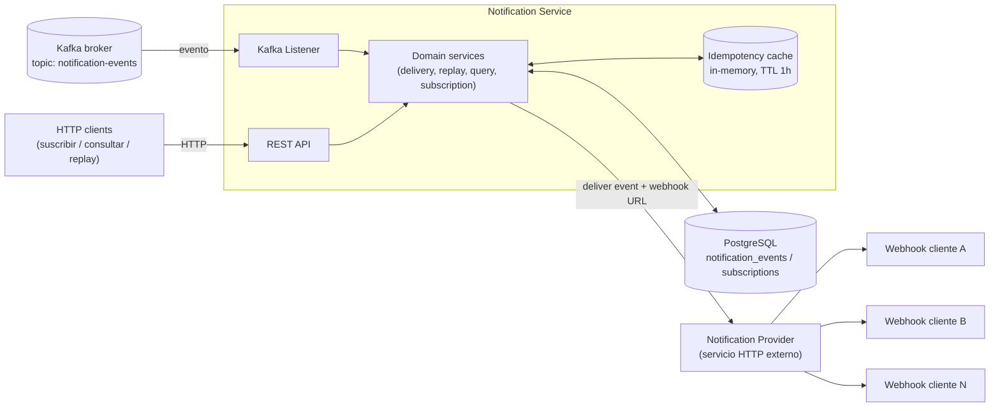
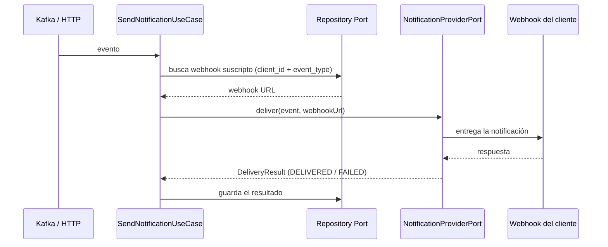

# cobre-challenge — Notification Service

## Stack

- **Java 27** (toolchain fijado en `build.gradle`)
- **Gradle 9.7.1** (via wrapper, `./gradlew`)
- **Spring Boot 4.1.1**, PostgreSQL + Flyway, Spring Kafka, Resilience4j (retry), Datadog (DogStatsD), SpringDoc OpenAPI
- **Virtual threads** (`spring.threads.virtual.enabled=true`): todo el I/O de este servicio es bloqueante (RestClient, JPA, el servlet container) — no hay nada reactivo. Los virtual threads dejan escalar ese I/O bloqueante (muchas conexiones esperando respuesta a la vez: DB, Kafka, el Notification Provider) sin necesitar un stack reactivo ni tunear pools de threads a mano.

## Descripción

Servicio que consume eventos generados por la plataforma (vía Kafka, o vía HTTP para pruebas), los deduplica, busca si el cliente tiene un webhook suscripto a ese tipo de evento, entrega el evento a través de un **Notification Provider** externo (que reenvía al webhook del cliente), y persiste el resultado de cada intento. Expone además una API de self-service para consultar el historial de eventos por cliente y reintentar (`replay`) los que fallaron.

Arquitectura hexagonal: el dominio (`domain/`) no conoce Kafka, HTTP, Postgres ni Datadog — solo define puertos (`port/in`, `port/out`) que los adaptadores (`adapter/in`, `adapter/out`) implementan.

## Arquitectura

- **Kafka**: fuente principal de eventos (`notification.events.topic`). El listener y el endpoint `POST /notification_events` alimentan el mismo caso de uso.
- **PostgreSQL**: `notification_events` (resultado final de cada evento procesado, una fila por `client_id + event_id`) y `subscriptions` (webhook activo por `user_id + event_type`, **más el score y el estado del circuit breaker de ese webhook** — ver [Suscripciones y webhooks](#suscripciones-y-webhooks)).
- **Idempotency cache**: mapa en memoria (`InMemoryIdempotencyStore`), clave = `event_id`, TTL configurable. Evita reentregar un evento ya delivered dentro de la ventana; el estado durable de "ya entregado" vive en la DB (`delivery_status`), no acá (más detalle en [Idempotencia y resiliencia](#idempotencia-y-resiliencia)).
- **Notification Provider**: servicio externo al que le pegamos por HTTP (con retry); es quien efectivamente llama al webhook del cliente. El circuit breaker vive por webhook, en la tabla `subscriptions` (ver [Suscripciones y webhooks](#suscripciones-y-webhooks)), así el webhook roto de un cliente no bloquea la entrega a los demás.

## Flujo principal

Camino feliz de un evento (Kafka o `POST /notification_events`): busca el webhook suscripto, entrega la notificación y persiste el resultado.

`Repository Port` agrupa los dos puertos de persistencia del dominio — `SubscriptionPort` (busca el webhook) y `NotificationRecordPort` (guarda el resultado) — ambos son la misma clase de puerto: la interfaz para leer/guardar en donde sea que viva el dato, sin que el dominio sepa que hoy es PostgreSQL.

Antes de este camino, el servicio corta temprano si el evento ya fue entregado (idempotencia), si no hay webhook suscripto, o si el circuit breaker de ese webhook está abierto — ver [Idempotencia y resiliencia](#idempotencia-y-resiliencia), [Suscripciones y webhooks](#suscripciones-y-webhooks) y la tabla de [otros endpoints](#otros-endpoints) para `replay`.

## Idempotencia y resiliencia

### Idempotencia

Antes de entregar un evento, `NotificationDeliveryService` chequea si ya fue entregado (`IdempotencyPort.isDuplicate`), para no reenviarlo si Kafka lo redelivera o la plataforma lo reenvía. La implementación (`InMemoryIdempotencyStore`) es un mapa en memoria, clave = `event_id` (único a nivel plataforma), con expiración por TTL.

| Property | Qué configura |
|---|---|
| `idempotency.ttl` | Ventana de tiempo durante la cual un `event_id` ya marcado como entregado se considera duplicado. Pasado el TTL, un evento con ese id vuelve a ser elegible para entrega. |

Es una caché en memoria de una sola instancia — no es la fuente de verdad. El estado durable de "ya entregado" es el `delivery_status` persistido en `notification_events`, que es lo que efectivamente evita un doble delivery en el endpoint de `replay`.

### Retry

`NotificationProviderHttpClient` envuelve cada llamada al Notification Provider con retry (Resilience4j), para absorber fallas transitorias (5xx, timeout, error de conexión) sin intervención manual. Un rechazo 4xx **no** se reintenta. Cada intento — el original y cada reintento — se registra por separado contra el [score del webhook](#score-y-circuit-breaker-por-webhook), no solo el resultado final.

| Property | Qué configura |
|---|---|
| `notification.provider.path` | Path del Notification Provider al que se hace `POST`. |
| `notification.provider.connect-timeout` | Timeout para establecer la conexión TCP. |
| `notification.provider.read-timeout` | Timeout de lectura de la respuesta una vez conectado. |
| `notification.provider.retry.max-attempts` | Cantidad máxima de intentos (incluye el primero) ante fallas transitorias. |
| `notification.provider.retry.wait-duration` | Espera base entre reintentos. |
| `notification.provider.retry.exponential-backoff-multiplier` | Multiplicador aplicado a `wait-duration` en cada intento sucesivo (con 200ms y multiplicador 2.0: 200ms, 400ms, 800ms...). |

Un evento cuya entrega falla definitivamente (reintentos agotados, o circuit breaker de ese webhook abierto — ver [Suscripciones y webhooks](#suscripciones-y-webhooks)) queda registrado (`delivery_status=FAILED` o `CIRCUIT_OPEN`) y puede reintentarse explícitamente vía `POST /notification_events/{id}/replay`.

## Suscripciones y webhooks

### Cómo le llega una notificación al webhook

`POST /subscriptions` registra, para el cliente indicado en el header `x-user-id`, la URL de webhook a la que quiere recibir las notificaciones de un tipo de evento (`SubscriptionService` → tabla `subscriptions`, única fila por `user_id + event_type`; volver a suscribirse con el mismo par actualiza la URL en vez de duplicar la fila). El `user_id` sale siempre del header, nunca del body — así no se puede suscribir en nombre de otro cliente solo con conocer su `user_id`.

Cuando llega un evento de ese tipo para ese cliente, `NotificationDeliveryService` busca esa URL (`SubscriptionPort.findWebHookUrl`) y se la pasa al **Notification Provider** externo junto con el evento (`NotificationProviderHttpClient` → `POST` al provider, con el `webhook_url` como parte del payload). Es el Notification Provider quien efectivamente hace la llamada HTTPS al webhook del cliente — este servicio nunca le pega directo al webhook. La respuesta que el provider recibe de esa llamada (status code) es lo que determina si el evento queda `DELIVERED` o `FAILED`.

Esa misma respuesta alimenta el circuit breaker de ese webhook (siguiente sección) — y lo hace **por cada intento HTTP real**, no una sola vez por evento: si `NotificationProviderHttpClient` reintenta internamente (ver [Retry](#retry)) porque una respuesta fue transitoriamente mala, cada intento individual — el que falló y el que finalmente tuvo éxito — se registra por separado contra el score. Un evento que falla una vez y se recupera al reintentar cuenta como una falla **y** un éxito para ese webhook, no se colapsa en un solo resultado.

### Score y circuit breaker por webhook

Cada webhook (cada fila de `subscriptions`) tiene su propio **circuit breaker independiente**: el webhook roto de un cliente nunca bloquea la entrega a los webhooks sanos de otros clientes.

El estado vive en la propia tabla `subscriptions`:

| Columna | Qué es |
|---|---|
| `success_score` | Score 0-100: % de éxito reciente de ese webhook. Se recalcula en cada **intento HTTP real** contra el Notification Provider — incluidos los reintentos internos de Resilience4j, cada uno por separado, no solo el resultado final de la entrega — como un promedio ponderado (`score = score_anterior × (1 − α) + resultado × α`, con `resultado` = 100 si tuvo éxito o 0 si falló). Así los resultados recientes pesan más que el historial viejo, sin necesidad de guardar cada llamada individual. |
| `total_calls` | Cantidad de intentos HTTP contabilizados para ese webhook (uno por cada intento real, no por evento). |
| `circuit_state` | `CLOSED` (sano, entrega normal), `OPEN` (bloqueado, no se llama al provider) o `HALF_OPEN` (probando de nuevo con cupo limitado). |
| `circuit_opened_at` | Cuándo se abrió el circuito por última vez (usado para saber cuándo pasar a `HALF_OPEN`). |
| `half_open_calls` | Cuántas llamadas de prueba ya se dejaron pasar en el estado `HALF_OPEN`. |

Transiciones (`WebhookCircuitBreakerJpaAdapter`):

- **CLOSED → OPEN**: cuando, después de al menos `minimum-number-of-calls` intentos, el score queda por debajo de `min-success-score`.
- **OPEN**: mientras está abierto, `NotificationDeliveryService` ni siquiera llama al Notification Provider para ese webhook — el evento queda directamente como `CIRCUIT_OPEN` (se guarda igual, para poder consultarlo y reintentarlo).
- **OPEN → HALF_OPEN**: al cumplirse `wait-duration-in-open-state` desde que se abrió, la siguiente entrega automática se deja pasar como prueba.
- **HALF_OPEN**: deja pasar hasta `permitted-number-of-calls-in-half-open-state` intentos de prueba. Si uno falla, reabre (`OPEN`) inmediatamente. Si uno tiene éxito y el score ya recuperó el umbral, cierra (`CLOSED`).
- **Cambiar la URL del webhook** (volver a llamar a `POST /subscriptions` con una URL distinta) resetea el score y el estado a `CLOSED` — es potencialmente un endpoint distinto, no arrastra el historial del anterior. Volver a mandar la misma URL no resetea nada.

| Property | Qué configura |
|---|---|
| `notification.webhook.circuit-breaker.min-success-score` | Umbral (0-100): si el score cae por debajo, el circuito de ese webhook se abre. |
| `notification.webhook.circuit-breaker.minimum-number-of-calls` | Mínimo de intentos antes de que el circuit breaker empiece a evaluar si abre o no (para no abrir con una sola muestra). |
| `notification.webhook.circuit-breaker.wait-duration-in-open-state` | Cuánto tiempo se mantiene `OPEN` antes de pasar a `HALF_OPEN`. |
| `notification.webhook.circuit-breaker.permitted-number-of-calls-in-half-open-state` | Cantidad de llamadas de prueba permitidas en `HALF_OPEN`. |
| `notification.webhook.circuit-breaker.score-smoothing-factor` | El `α` del promedio ponderado del score (0-1). Más alto = el score reacciona más rápido a los resultados recientes. |

### El replay nunca queda bloqueado

`POST /notification_events/{id}/replay` (reintento manual) **ignora** tanto el circuit breaker del webhook como la caché de idempotencia — las dos cosas que sí frenan el flujo automático:

- **Circuit breaker**: siempre intenta la entrega real, incluso con el webhook en `OPEN`. Es la vía deliberada para recuperar un evento puntual sin esperar la ventana de `HALF_OPEN`. Su resultado sí se registra en el score — una racha de replays exitosos puede cerrar el circuito antes de que termine la ventana de espera, sin necesidad de tráfico automático.
- **Idempotencia**: `NotificationEventReplayService` nunca consulta `IdempotencyPort.isDuplicate` — esa caché existe para no reentregar un evento en el flujo automático (ver [Idempotencia](#idempotencia)), no para decidir si un reintento manual puede o no ejecutarse. Lo que sí bloquea un replay es el `delivery_status` persistido: si ya está `DELIVERED`, es un no-op (ver más abajo), pero eso lo decide la base, no la caché en memoria.

## Otros endpoints

| Método | Path | Descripción |
|---|---|---|
| `POST` | `/notification_events` | Ingesta manual de un evento (mismo caso de uso que consume el Kafka listener). Body: `event_id`, `event_type`, `content`, `delivery_date`, `client_id`. |
| `GET` | `/notification_events` | Lista los eventos del cliente indicado en el header `x-user-id`. Filtros opcionales `delivery_status`, `created_from`, `created_to`; paginado con `limit`/`offset` (con topes configurables); ordenado por `delivery_date` descendente. |
| `GET` | `/notification_events/{notification_event_id}` | Detalle de un evento. `400` si el `x-user-id` no coincide con el dueño del evento, `404` si no existe. |
| `POST` | `/notification_events/{notification_event_id}/replay` | Reintenta la entrega. Si ya está `DELIVERED`, es un no-op (no vuelve a llamar al provider). Misma validación de `x-user-id` que el GET por id. |
| `POST` | `/subscriptions` | Crea o actualiza el webhook del cliente indicado en `x-user-id` para un tipo de evento. Body: `event_type`, `web_hook_url`. |
| `GET` | `/health` | Liveness check. |

## Métricas

Todas se emiten como counters (vía `MetricsPort`, hoy implementado con Datadog/DogStatsD — ver diagrama de arquitectura). Los tags van en formato `key:value`.

`client_id` está en todas — es el tag más útil para aislar el comportamiento de un cliente puntual. `webhook` (la URL del webhook) se suma en las métricas que ya conocen esa URL en el momento de emitirse.

| Métrica | Tags | Qué mide |
|---|---|---|
| `notification.events.received` | `event_type`, `client_id` | Cada evento que entra al flujo de entrega (desde Kafka o HTTP), antes de cualquier chequeo. Volumen total de eventos procesados. |
| `notification.events.duplicate` | `event_type`, `client_id` | Eventos descartados por el chequeo de idempotencia (ya habían sido entregados). Sirve para medir cuántos duplicados llegan. |
| `notification.subscription.webhook_found` | `event_type`, `client_id`, `webhook` | Búsquedas de suscripción que encontraron un webhook activo para ese `client_id` + `event_type`. |
| `notification.subscription.webhook_not_found` | `event_type`, `client_id` | Búsquedas sin suscripción — el evento no se puede entregar (misses de suscripción; no hay `webhook` porque justamente no se encontró ninguno). |
| `notification.webhook.response` | `status_code`, `event_type`, `client_id`, `webhook` | Cada respuesta del Notification Provider (éxito, rechazo 4xx, error 5xx) o `status_code:timeout` si no hubo respuesta. Permite monitorear la salud de la entrega a los webhooks por código de respuesta. |
| `notification.webhook.circuit_opened` | `event_type`, `client_id`, `webhook` | Se emite en el momento exacto en que el circuit breaker de un webhook pasa a `OPEN` (o reabre desde `HALF_OPEN`). Pensada para alertar apenas un webhook puntual empieza a fallar. |
| `notification.webhook.delivery_blocked` | `event_type`, `client_id`, `webhook` | Cada intento automático de entrega que se saltea porque el circuit breaker de ese webhook ya está `OPEN` (no se llegó a llamar al provider). |
| `notification.events.saved` | `delivery_status`, `client_id` | Cada vez que se persiste el resultado final de un evento en la base, agrupado por el estado guardado (`DELIVERED`, `FAILED`, `CIRCUIT_OPEN`, etc). |
| `notification.security.access_denied` | `client_id` | Cada `USER_MISMATCH` (un `x-user-id` pidiendo/reintentando un evento que no le pertenece). |

## Seguridad

La API está pensada para exponerse públicamente a internet. Análisis contra el código actual (OWASP Top 10:2021) — todos los hallazgos, cada uno con su propuesta de mitigación (**sin aplicar todavía**, salvo donde se aclara lo contrario):

### A01:2021 — Broken Access Control

El `client_id`/`user_id` que determina de quién son los datos sale del header `x-user-id`, sin verificar que quien lo manda sea realmente ese cliente: `GET /notification_events`, `GET /notification_events/{id}`, el `replay` y `POST /subscriptions` (`NotificationController.java`, `SubscriptionController.java`) toman ese header y confían en él — no hay nada que pruebe la identidad del caller detrás.

**Impacto**: es trivial hacerse pasar por otro cliente con solo cambiar un header — leer, reintentar o crear suscripciones en nombre de cualquier `client_id` que se conozca (IDOR).

**Propuesta de mitigación**: misma causa raíz que A07 — se resuelven juntas con **API key por cliente**, el esquema estándar para una API service-to-service como esta:
- Tabla `clients` (`client_id`, hash de la API key — nunca la key en texto plano, igual que una contraseña — `created_at`, `revoked_at`).
- Un filtro (mismo lugar que `RateLimitFilter`, antes de que el request llegue al controller) que valida el header `Authorization: Bearer <api_key>` contra esa tabla y resuelve el `client_id` real.
- Sacar `x-user-id` de la ecuación por completo — el `client_id` sale siempre del principal autenticado (resuelto a partir de la API key), nunca de un header que el caller controla.

### A07:2021 — Identification and Authentication Failures

Causa raíz del punto anterior: no hay ningún mecanismo de autenticación en el servicio. `build.gradle` no tiene `spring-boot-starter-security` ni ninguna dependencia de auth — todos los endpoints (`/notification_events`, `/subscriptions`) son públicos sin excepción, ni siquiera Basic Auth.

**Propuesta de mitigación**: la misma API key de A01. Una vez implementada, el rate limiting de la sección de abajo también puede pasar a ser por `client_id` en vez de por IP — mucho más difícil de eludir que el límite actual.

### A02:2021 — Cryptographic Failures

`SubscriptionRequest.webHookUrl` se valida solo con `@URL` (Hibernate Validator, `SubscriptionRequest.java:10`), que acepta `http://` igual que `https://` — no hay validación de esquema. Un webhook registrado en `http://` viaja en texto plano, interceptable/modificable en tránsito (y puede contener datos de pagos en el campo `content`).

**Propuesta de mitigación**: un `ConstraintValidator` custom (reemplazando el `@URL` genérico en `SubscriptionRequest.webHookUrl`) que rechace cualquier esquema que no sea `https`. Cambio chico y acotado — no requiere tocar el resto del flujo de entrega.

### A05:2021 — Security Misconfiguration (Unrestricted Resource Consumption)

El [rate limiting](#rate-limiting) es por IP — no hay autenticación (ver A01/A07) para usar `client_id` como clave — así que un atacante con varias IPs lo elude. Tampoco hay límite de tamaño de body en ningún endpoint.

**Propuesta de mitigación**: límite explícito de tamaño de body (`server.tomcat.max-http-form-post-size` / un filtro dedicado), y migrar la clave del rate limit de IP a `client_id` una vez exista autenticación (A01/A07) — no depende de una librería nueva, solo de tener una identidad confiable para usar como clave.

## Rate limiting

Ver A05 en [Seguridad](#seguridad): mientras no haya autenticación (A01/A07) no hay una identidad confiable para usar como clave, así que `RateLimitFilter` limita requests por **IP del caller** (primer hop de `X-Forwarded-For` si está detrás de un proxy/load balancer, si no `getRemoteAddr()`), con un token bucket en memoria por IP — permite ráfagas cortas hasta la capacidad configurada, y se recarga a un ritmo constante. Mismo caveat que `InMemoryIdempotencyStore`: es por instancia, no compartido entre réplicas.

Dos niveles, cada uno con su propio balde (no comparten cupo):

- **`general`**: cualquier request bajo `/notification_events` o `/subscriptions` que no caiga en el nivel `strict`.
- **`strict`**: `POST /subscriptions` y `POST /notification_events/{id}/replay` — las operaciones de mayor riesgo (`POST /subscriptions` es el vector del A01 de arriba) y más costosas (disparan una llamada saliente real). Se trackean por separado entre sí — agotar el cupo de `replay` no afecta el de `subscribe`.

`/health`, `/v3/api-docs` y `/swagger-ui/**` no tienen límite.

| Property | Qué configura |
|---|---|
| `rate-limit.general.capacity` | Máximo de requests en ráfaga por IP para el nivel general. |
| `rate-limit.general.refill-tokens` | Cuántos tokens se recargan cada `refill-period`. |
| `rate-limit.general.refill-period` | Ventana de tiempo de la recarga (junto con `refill-tokens` da el rate sostenido, ej. 60/60/1m = 60 req/min). |
| `rate-limit.strict.capacity` | Igual que `general.capacity`, pero para `POST /subscriptions` y el replay. |
| `rate-limit.strict.refill-tokens` | Igual que `general.refill-tokens`, para el nivel estricto. |
| `rate-limit.strict.refill-period` | Igual que `general.refill-period`, para el nivel estricto. |

Un request bloqueado devuelve `429` con `{"code": "RATE_LIMITED", "message": "..."}`.

## Documentación técnica (OpenAPI)

La API REST se documenta automáticamente con **SpringDoc OpenAPI** (`springdoc-openapi-starter-webmvc-ui`), a partir de los controllers y las anotaciones `@Tag` / `@Operation` / `@Parameter` / `@ApiResponse` puestas en `NotificationController` y `SubscriptionController`. Con la app corriendo:

- Spec en JSON: `GET /v3/api-docs`
- UI interactiva (Swagger UI): `GET /swagger-ui.html` (sirve `/swagger-ui/index.html`)
