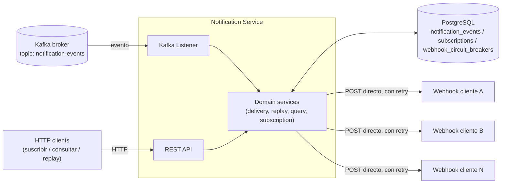
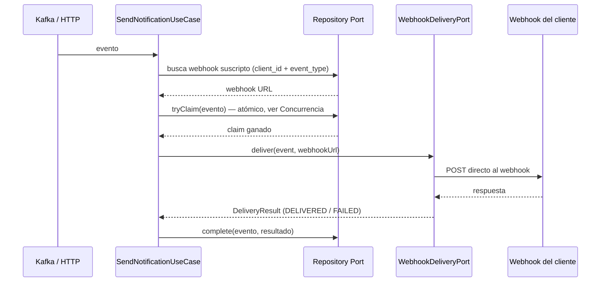

# cobre-challenge — Notification Service

## Stack

- **Java 27** (toolchain fijado en `build.gradle`)
- **Gradle 9.7.1** (via wrapper, `./gradlew`)
- **Spring Boot 4.1.1**, PostgreSQL + Flyway, Spring Kafka, Resilience4j (retry), Datadog (DogStatsD), SpringDoc OpenAPI
- **Virtual threads** (`spring.threads.virtual.enabled=true`): todo el I/O de este servicio es bloqueante (RestClient, JPA, el servlet container) — no hay nada reactivo. Los virtual threads dejan escalar ese I/O bloqueante (muchas conexiones esperando respuesta a la vez: DB, Kafka, los webhooks de los clientes) sin necesitar un stack reactivo ni tunear pools de threads a mano.

## Descripción

Servicio que consume eventos generados por la plataforma (vía Kafka, o vía HTTP para pruebas), los deduplica, busca si el cliente tiene un webhook suscripto a ese tipo de evento, entrega el evento llamando directamente por HTTPS al webhook del cliente, y persiste el resultado de cada intento. Expone además una API de self-service para consultar el historial de eventos por cliente y reintentar (`replay`) los que fallaron.

Arquitectura hexagonal: el dominio (`domain/`) no conoce Kafka, HTTP, Postgres ni Datadog — solo define puertos (`port/in`, `port/out`) que los adaptadores (`adapter/in`, `adapter/out`) implementan.

## Arquitectura



- **Kafka**: fuente principal de eventos (`notification.events.topic`). El listener y el endpoint `POST /notification_events` alimentan el mismo caso de uso.
- **PostgreSQL**: `notification_events` (resultado final de cada evento procesado, una fila por `client_id + event_id` — también la pieza que hace atómica la deduplicación y el control de concurrencia, ver [Concurrencia y race conditions](#concurrencia-y-race-conditions)), `subscriptions` (webhook activo por `user_id + event_type`) y `webhook_circuit_breakers` (**score y estado del circuit breaker de ese webhook**, una fila por `(client_id, web_hook_url)` — ver [Suscripciones y webhooks](#suscripciones-y-webhooks)).
- **Webhook del cliente**: el servicio le pega directo por HTTPS (con retry, `WebhookHttpClient`) — no hay ningún intermediario. El circuit breaker vive por webhook, en `webhook_circuit_breakers` (ver [Suscripciones y webhooks](#suscripciones-y-webhooks)), así el webhook roto de un cliente no bloquea la entrega a los demás.

## Flujo principal

Camino feliz de un evento (Kafka o `POST /notification_events`): busca el webhook suscripto, entrega la notificación y persiste el resultado.



`Repository Port` agrupa los dos puertos de persistencia del dominio — `SubscriptionPort` (busca el webhook) y `NotificationRecordPort` (el claim atómico y el resultado final) — ambos son la misma clase de puerto: la interfaz para leer/guardar en donde sea que viva el dato, sin que el dominio sepa que hoy es PostgreSQL.

Antes de este camino, el servicio corta temprano si no hay webhook suscripto (`NOT_SUBSCRIBED`, sin tocar la base) o si pierde el claim atómico (`DUPLICATE` — ver [Concurrencia y race conditions](#concurrencia-y-race-conditions), que es también donde vive hoy la idempotencia); ya con el claim ganado, si el circuit breaker de ese webhook está abierto corta ahí (`CIRCUIT_OPEN`) sin llamar al webhook. Ver [Suscripciones y webhooks](#suscripciones-y-webhooks) y [API de self-service](#api-de-self-service-consulta-y-reintento-de-eventos) para `replay`.

## Idempotencia y resiliencia

### Idempotencia

La fuente de verdad es el mismo claim atómico en base que resuelve las race conditions (ver [Concurrencia y race conditions](#concurrencia-y-race-conditions)): `event_id` es único a nivel plataforma, y una vez que un evento queda `DELIVERED`, ningún intento posterior (Kafka redeliver, un resend de la plataforma) vuelve a llamar al webhook — `NotificationRecordPort#tryClaim` lo rechaza directamente contra la fila persistida, indefinidamente, sin TTL.

Delante de eso hay un `IdempotencyPort`, una caché **best-effort** (`isDuplicate` / `markAsProcessed`) que evita el round-trip a Postgres para el caso obvio — un evento que ya sabemos que se entregó. No es una segunda fuente de verdad: un miss simplemente cae al claim de Postgres, que es quien decide de verdad. La implementación cambia según el perfil:

- **`local`**: `InMemoryIdempotencyCache`, un `ConcurrentHashMap` con TTL — no hace falta levantar Redis para correr la app en desarrollo.
- **Cualquier otro perfil**: `RedisIdempotencyCache`, un `SET key EX ttl` / `GET` contra Redis.

La razón de Redis en producción no es de corrección — el claim en Postgres ya es correcto sin importar cuántas instancias del servicio corran al mismo tiempo, porque todas comparten la misma base. Es de **costo**: sin una caché compartida entre nodos, cada instancia solo se acuerda de los eventos que ella misma procesó, así que un duplicado que cae en una instancia distinta a la que entregó el original no tiene forma de evitar el round-trip a Postgres (que ahora es una escritura — el `INSERT ... ON CONFLICT` de `tryClaim` — no una lectura gratis). Redis, al ser compartido entre nodos, filtra ese caso también, y esa escritura a Postgres nunca llega a pasar.

| Property | Qué configura |
|---|---|
| `idempotency.ttl` | Cuánto tiempo se recuerda un `event_id` ya entregado en la caché (Redis o el mapa local), antes de volver a caer en el claim de Postgres. No afecta la corrección — solo cuántos duplicados se filtran antes de tocar la base. |
| `spring.data.redis.host` / `spring.data.redis.port` | Conexión al Redis compartido (ignoradas en el perfil `local`, que no lo usa). |

### Retry

`WebhookHttpClient` envuelve cada llamada directa al webhook del cliente con retry (Resilience4j), para absorber fallas transitorias (5xx, timeout, error de conexión) sin intervención manual. Un rechazo 4xx **no** se reintenta. Cada intento — el original y cada reintento — se registra por separado contra el [score del webhook](#score-y-circuit-breaker-por-webhook), no solo el resultado final.

Solo un **2xx** cuenta como entrega exitosa — se valida explícitamente (`response.getStatusCode().is2xxSuccessful()`), no alcanza con "no tiró excepción": `RestClient` solo lanza excepción para 4xx/5xx por default, así que un 3xx (redirect) llegaría igual hasta ese punto y, sin el chequeo, se hubiera guardado como `DELIVERED` sin que el webhook realmente haya aceptado el evento. Los redirects tampoco se siguen automáticamente (`HttpURLConnection.setInstanceFollowRedirects(false)` vía `prepareConnection`) — así `WebhookHttpClient` ve siempre la respuesta real de la URL registrada, no la de a dónde esa URL redirige (que podría ser otro host, o un downgrade de `https` a `http`). Un 3xx se trata igual que un 4xx: rechazo, no reintentable — pegarle de nuevo a la misma URL daría el mismo redirect.

| Property | Qué configura |
|---|---|
| `notification.webhook.delivery.connect-timeout` | Timeout para establecer la conexión TCP con el webhook. |
| `notification.webhook.delivery.read-timeout` | Timeout de lectura de la respuesta una vez conectado. |
| `notification.webhook.delivery.retry.max-attempts` | Cantidad máxima de intentos (incluye el primero) ante fallas transitorias. |
| `notification.webhook.delivery.retry.wait-duration` | Espera base entre reintentos. |
| `notification.webhook.delivery.retry.exponential-backoff-multiplier` | Multiplicador aplicado a `wait-duration` en cada intento sucesivo (con 200ms y multiplicador 2.0: 200ms, 400ms, 800ms...). |

Un evento cuya entrega falla definitivamente (reintentos agotados, o circuit breaker de ese webhook abierto — ver [Suscripciones y webhooks](#suscripciones-y-webhooks)) queda registrado (`delivery_status=FAILED` o `CIRCUIT_OPEN`) y puede reintentarse explícitamente vía `POST /notification_events/{id}/replay` — ver [API de self-service](#api-de-self-service-consulta-y-reintento-de-eventos).

## Concurrencia y race conditions

Antes, "¿ya se procesó este evento?" y "marcarlo como procesado" eran dos pasos separados — chequear, entregar, recién después persistir. Cualquier cosa que se cruzara entre esos pasos (dos requests concurrentes para el mismo evento, un replay que corre dos veces, un crash justo después de llamarle al webhook) dejaba un estado inconsistente: doble entrega, o una entrega exitosa que el sistema nunca llegó a registrar. Ninguno de los dos problemas se arregla reordenando esos pasos — hace falta que **decidir quién procesa un evento sea, en sí mismo, una operación atómica y durable**, no una secuencia de pasos que alguien puede interrumpir en el medio.

### El mecanismo: reservar la fila antes de llamar al webhook, no después

`NotificationRecordPort#tryClaim` (para eventos nuevos, vía HTTP o Kafka) y `#tryClaimForReplay` (para `POST .../replay`) son cada uno **una sola sentencia SQL** contra `notification_events`:

- `tryClaim`: `INSERT ... ON CONFLICT (client_id, event_id) DO UPDATE ... WHERE delivery_status IN ('FAILED', 'CIRCUIT_OPEN')`. Inserta la fila como `PROCESSING` si es la primera vez, o la vuelve a poner en `PROCESSING` si la última vez terminó en un estado legítimamente reintentable — cualquier otro caso (ya `DELIVERED`, o alguien más la está procesando en este mismo instante) no matchea el `WHERE`, el conflicto no se resuelve, y la sentencia devuelve 0 filas afectadas.
- `tryClaimForReplay`: mismo criterio pero como `UPDATE ... WHERE notification_event_id = :id AND delivery_status IN ('FAILED', 'CIRCUIT_OPEN')`.

Postgres resuelve el conflicto bajo lock de fila como parte de la propia sentencia — por eso, ante N llamadas concurrentes para el mismo evento (dos instancias, una redelivery de Kafka cruzándose con un reintento HTTP, dos replays al mismo tiempo), **una sola puede ganar** el claim (devuelve `true`); el resto recibe `false` sin haber tocado el webhook, y responde `DUPLICATE`. No es un `SELECT` seguido de un `INSERT` — es una única sentencia, así que no existe una ventana entre "consultar" y "actuar" donde otro caller pueda colarse.

Recién después de ganar el claim se llama al webhook, y el resultado final se escribe con `NotificationRecordPort#complete` (otra sentencia separada, ya con el `delivery_status` terminal: `DELIVERED`, `FAILED`, `CIRCUIT_OPEN` o `NOT_SUBSCRIBED`). El claim y el `complete` son dos transacciones cortas independientes — la llamada HTTP al webhook (con sus reintentos) pasa **fuera** de cualquier transacción, para no mantener un lock de fila abierto en Postgres durante todo ese tiempo.

### Por qué esto cierra la ventana de "entrega exitosa sin registro"

Porque la fila ya existe en la base **antes** de llamar al webhook, no después. Si el proceso muere justo después de que el webhook respondió pero antes de que `complete` termine de escribir, el evento no desaparece — queda visible en `GET /notification_events` con `delivery_status=PROCESSING`, en vez de no existir en ningún lado.

### La ventana que el claim solo no cierra

Si el proceso muere entre ganar el claim y llamar a `complete`, esa fila queda en `PROCESSING` para siempre — nadie la va a reintentar automáticamente, porque como ya está claimeada no matchea el `WHERE` de `tryClaim`/`tryClaimForReplay`. `StuckProcessingRecoveryJob` es un barrido periódico (`@Scheduled`) que encuentra filas en `PROCESSING` más viejas que el umbral configurado y las pasa a `FAILED` — así vuelven a ser recuperables por el mismo `POST /notification_events/{id}/replay` que ya existe, sin necesidad de un mecanismo de recuperación aparte.

| Property | Qué configura |
|---|---|
| `notification.events.stuck-processing.threshold` | Cuánto tiempo puede estar una fila en `PROCESSING` antes de considerarse atascada (el proceso que la reclamó murió a mitad de camino). |
| `notification.events.stuck-processing.sweep-interval` | Cada cuánto corre el barrido que busca filas atascadas. |

### Por qué esto es correcto entre réplicas, y no solo dentro de una instancia

Antes de este cambio, la única defensa contra un duplicado era una caché en memoria por instancia — solo correcta corriendo una única réplica, porque dos instancias no se enteraban una de la otra. El claim atómico usa Postgres como única fuente de verdad compartida, así que hoy es correcto sin importar cuántas instancias del servicio estén corriendo al mismo tiempo: todas compiten por la misma fila, en la misma base — con o sin la caché best-effort de [Idempotencia](#idempotencia) delante (esa sí sigue siendo por-instancia en el perfil `local`, pero ahí nunca corre más de una réplica; en el resto de los perfiles es Redis, compartida). Mismo motivo por el que el circuit breaker vive en Postgres (tabla `webhook_circuit_breakers`) y no en memoria (ver [Score y circuit breaker por webhook](#score-y-circuit-breaker-por-webhook)). El único mecanismo que sigue siendo por-instancia en todo perfil es `RateLimitFilter`, documentado como tal en [Rate limiting](#rate-limiting).

## Suscripciones y webhooks

### Cómo le llega una notificación al webhook

`POST /subscriptions` registra, para el cliente indicado en el header `x-user-id`, la URL de webhook a la que quiere recibir las notificaciones de un tipo de evento (`SubscriptionService` → tabla `subscriptions`, única fila por `user_id + event_type`; volver a suscribirse con el mismo par actualiza la URL en vez de duplicar la fila). El `user_id` sale siempre del header, nunca del body — así no se puede suscribir en nombre de otro cliente solo con conocer su `user_id`.

Cuando llega un evento de ese tipo para ese cliente, `NotificationDeliveryService` busca esa URL (`SubscriptionPort.findWebHookUrl`) y `WebhookHttpClient` hace un `POST` HTTPS directo a esa URL con el evento como body — no hay ningún intermediario entre este servicio y el webhook del cliente. La respuesta de esa llamada (status code) es lo que determina si el evento queda `DELIVERED` o `FAILED`; el cuerpo de la respuesta se guarda (recortado a 1000 caracteres) como `webhook_response` (ver [A10 en Seguridad](#seguridad) para el riesgo de SSRF que esta llamada directa introduce).

Esa misma respuesta alimenta el circuit breaker de ese webhook (siguiente sección) — y lo hace **por cada intento HTTP real**, no una sola vez por evento: si `WebhookHttpClient` reintenta internamente (ver [Retry](#retry)) porque una respuesta fue transitoriamente mala, cada intento individual — el que falló y el que finalmente tuvo éxito — se registra por separado contra el score. Un evento que falla una vez y se recupera al reintentar cuenta como una falla **y** un éxito para ese webhook, no se colapsa en un solo resultado.

### Score y circuit breaker por webhook

Cada **webhook físico** (cada `(client_id, web_hook_url)` distinto) tiene su propio **circuit breaker independiente**: el webhook roto de un cliente nunca bloquea la entrega a los webhooks sanos de otros clientes.

El estado vive en su propia tabla, `webhook_circuit_breakers` — una fila por `(client_id, web_hook_url)`, con índice único sobre ese par. Se mantiene separada de `subscriptions` a propósito: qué webhook registró un cliente y cómo se viene comportando ese webhook son dos cosas distintas, que cambian por razones distintas y en momentos distintos — una no debería obligar a tocar la otra.

**Por qué está scopeado por URL y no por suscripción**: un cliente puede apuntar varios `event_type` a la misma URL (el mismo endpoint recibiendo `credit_card_payment` y `debit_card_withdrawal`, por ejemplo). Si el breaker viviera por suscripción, cada `event_type` acumularía fallas por separado contra ese mismo endpoint — un webhook roto tardaría más en abrirse (cada `event_type` necesitando alcanzar su propio `minimum-number-of-calls`) y mientras tanto seguiría recibiendo tráfico real una vez por cada `event_type` que apunta a él, en vez de una sola vez. Con el breaker scopeado por `(client_id, web_hook_url)`, todos los `event_type` que comparten un webhook sí comparten su score y su estado: una falla contra ese endpoint cuenta para todos, así que el circuito se abre tan pronto como corresponde y protege al webhook por igual sin importar cuántos tipos de evento le apuntan.

| Columna | Qué es |
|---|---|
| `success_score` | Score 0-100: % de éxito reciente de ese webhook. Se recalcula en cada **intento HTTP real** contra el webhook — incluidos los reintentos internos de Resilience4j, cada uno por separado, no solo el resultado final de la entrega — como un promedio ponderado (`score = score_anterior × (1 − α) + resultado × α`, con `resultado` = 100 si tuvo éxito o 0 si falló). Así los resultados recientes pesan más que el historial viejo, sin necesidad de guardar cada llamada individual. |
| `total_calls` | Cantidad de intentos HTTP contabilizados para ese webhook (uno por cada intento real, no por evento). |
| `circuit_state` | `CLOSED` (sano, entrega normal), `OPEN` (bloqueado, no se llama al webhook) o `HALF_OPEN` (probando de nuevo con cupo limitado). |
| `circuit_opened_at` | Cuándo se abrió el circuito por última vez (usado para saber cuándo pasar a `HALF_OPEN`). |
| `half_open_calls` | Cuántas llamadas de prueba ya se dejaron pasar en el estado `HALF_OPEN`. |

Transiciones (`WebhookCircuitBreakerJpaAdapter`):

- **CLOSED → OPEN**: cuando, después de al menos `minimum-number-of-calls` intentos, el score queda por debajo de `min-success-score`.
- **OPEN**: mientras está abierto, `NotificationDeliveryService` ni siquiera llama al webhook — el evento queda directamente como `CIRCUIT_OPEN` (se guarda igual, para poder consultarlo y reintentarlo).
- **OPEN → HALF_OPEN**: al cumplirse `wait-duration-in-open-state` desde que se abrió, la siguiente entrega automática se deja pasar como prueba.
- **HALF_OPEN**: deja pasar hasta `permitted-number-of-calls-in-half-open-state` intentos de prueba. Si uno falla, reabre (`OPEN`) inmediatamente. Si uno tiene éxito y el score ya recuperó el umbral, cierra (`CLOSED`).
- **Cambiar la URL del webhook** (volver a llamar a `POST /subscriptions` con una URL distinta) mueve ese `event_type` al breaker de la nueva URL: si ningún otro `event_type` de ese cliente la usaba todavía, arranca sano (`CLOSED`, score 100) — es potencialmente un endpoint distinto, no arrastra el historial del anterior. Si la nueva URL ya la usa otro `event_type` de ese mismo cliente, se une al breaker que ya existe para ella (no lo resetea: ese historial sí es el real de ese endpoint). El breaker de la URL vieja se borra solo si ningún otro `event_type` de ese cliente sigue apuntándole. Volver a mandar la misma URL no cambia nada.

| Property | Qué configura |
|---|---|
| `notification.webhook.circuit-breaker.min-success-score` | Umbral (0-100): si el score cae por debajo, el circuito de ese webhook se abre. |
| `notification.webhook.circuit-breaker.minimum-number-of-calls` | Mínimo de intentos antes de que el circuit breaker empiece a evaluar si abre o no (para no abrir con una sola muestra). |
| `notification.webhook.circuit-breaker.wait-duration-in-open-state` | Cuánto tiempo se mantiene `OPEN` antes de pasar a `HALF_OPEN`. |
| `notification.webhook.circuit-breaker.permitted-number-of-calls-in-half-open-state` | Cantidad de llamadas de prueba permitidas en `HALF_OPEN`. |
| `notification.webhook.circuit-breaker.score-smoothing-factor` | El `α` del promedio ponderado del score (0-1). Más alto = el score reacciona más rápido a los resultados recientes. |

## API de self-service: consulta y reintento de eventos

Estos tres endpoints son el corazón de la self-service API pedida por el caso: que cada cliente pueda consultar el estado de sus propias notificaciones y reintentar las que fallaron, sin depender del equipo de plataforma.

### `GET /notification_events` — listar eventos

Lista los eventos del cliente indicado en el header `x-user-id`.

- **Filtros** (opcionales): `delivery_status` y rango de fecha del evento (`created_from` / `created_to`, sobre `event_delivery_date`).
- **Paginado**: `limit` y `offset` como query params, con topes configurables (`notification.events.query.default-limit`, `max-limit`, `max-offset`) para que nadie pueda forzar un escaneo completo de la tabla en un solo request — pasarse de esos topes devuelve `400` (`INVALID_PAGINATION`).
- **Orden**: siempre por `delivery_date` descendente (el más reciente primero), para que la paginación sea estable.
- La respuesta trae `total_elements` además de los `items`, para que el cliente sepa cuánto le falta paginar.

### `GET /notification_events/{notification_event_id}` — detalle de un evento

Devuelve el detalle completo de un evento puntual.

- **Seguridad**: cada evento pertenece a un `client_id`; si el `x-user-id` del request no coincide, `400` (`USER_MISMATCH`) — no `404`, para no filtrar si el id existe o no. Ese mismatch queda loggeado y con su propia métrica (`notification.security.access_denied`) para poder detectar intentos de acceso a eventos ajenos (ver [A01 en Seguridad](#seguridad) para la limitación de que `x-user-id` en sí todavía no está autenticado).
- `404` (`NOTIFICATION_EVENT_NOT_FOUND`) si el id no existe.

### `POST /notification_events/{notification_event_id}/replay` — reintentar una entrega

Reintenta la entrega de un evento puntual.

- **Misma validación de seguridad que el GET por id**: `400` si el `x-user-id` no es el dueño del evento, `404` si no existe.
- **No-op si ya está `DELIVERED`**: devuelve `DUPLICATE` sin volver a llamar al webhook — el `delivery_status` persistido es la fuente de verdad de "ya se entregó".
- **Tiene su propio claim atómico**, independiente del que usa el flujo automático (`NotificationRecordPort#tryClaimForReplay`, ver [Concurrencia y race conditions](#concurrencia-y-race-conditions)) — así que dos replays simultáneos del mismo evento, o un replay que se cruza con una redelivery automática, nunca llaman al webhook los dos: solo uno gana el claim, el otro recibe `DUPLICATE`.
- **Ignora el circuit breaker**: aunque el webhook esté `OPEN`, el replay igual intenta la entrega real — es la vía deliberada para recuperar un evento puntual sin esperar la ventana de `HALF_OPEN` (ver [Score y circuit breaker por webhook](#score-y-circuit-breaker-por-webhook)). Su resultado sí se registra en el score, así que una racha de replays exitosos puede cerrar el circuito antes de tiempo.

## Otros endpoints

`event_type` está limitado a una lista fija — el enum `EventType` (`CREDIT_CARD_PAYMENT`, `DEBIT_CARD_WITHDRAWAL`, `CREDIT_TRANSFER`, `DEBIT_AUTOMATIC_PAYMENT`, `CREDIT_REFUND`, `DEBIT_TRANSFER`, `CREDIT_DEPOSIT`, `DEBIT_PURCHASE`, `CREDIT_CASHBACK`, `DEBIT_SUBSCRIPTION`, tomados de los datos de ejemplo del caso), comparado sin distinguir mayúsculas/minúsculas. La validación vive en el constructor de `NotificationEvent` (dominio), no en el controller — así aplica igual sin importar si el evento entra por `POST /notification_events`, por Kafka o al reconstruirse en un `replay`. Un `event_type` fuera de esa lista devuelve `400` (`INVALID_EVENT_TYPE`) por HTTP, o queda para el error handler del listener (reintentos acotados) si entra por Kafka. `event_type` en `/subscriptions` **no** tiene esta restricción — un cliente puede suscribirse a un tipo antes de que exista tráfico real de ese tipo.

| Método | Path | Descripción |
|---|---|---|
| `POST` | `/notification_events` | Ingesta manual de un evento (mismo caso de uso que consume el Kafka listener). Body: `event_id`, `event_type`, `content`, `delivery_date`, `client_id`. `400` (`INVALID_EVENT_TYPE`) si `event_type` no está en la lista soportada. |
| `POST` | `/subscriptions` | Crea o actualiza el webhook del cliente indicado en `x-user-id` para un tipo de evento. Body: `event_type`, `web_hook_url`. |
| `GET` | `/subscriptions` | Lista las suscripciones del cliente indicado en `x-user-id` (una fila por `event_type`). |
| `PUT` | `/subscriptions/{event_type}` | Actualiza el webhook de una suscripción existente del cliente en `x-user-id`. A diferencia del `POST`, no crea una suscripción nueva: `404` (`SUBSCRIPTION_NOT_FOUND`) si no existía. |
| `DELETE` | `/subscriptions/{event_type}` | Elimina la suscripción del cliente en `x-user-id` para ese `event_type`. `204` sin body si se borró; `404` (`SUBSCRIPTION_NOT_FOUND`) si no existía. |
| `GET` | `/health` | Liveness check. |

## Métricas

Todas se emiten como counters (vía `MetricsPort`, hoy implementado con Datadog/DogStatsD — ver diagrama de arquitectura). Los tags van en formato `key:value`.

`client_id` está en todas — es el tag más útil para aislar el comportamiento de un cliente puntual. `webhook` (la URL del webhook) se suma en las métricas que ya conocen esa URL en el momento de emitirse.

| Métrica | Tags | Qué mide |
|---|---|-----------------------------------------------------------------------------------------------|
| `notification.events.received` | `event_type`, `client_id` | Cada evento que entra al flujo de entrega (desde Kafka o HTTP), antes de cualquier chequeo. Volumen total de eventos procesados. |
| `notification.events.duplicate` | `event_type`, `client_id` | Eventos descartados por el chequeo de idempotencia (ya habían sido entregados). Sirve para medir cuántos duplicados llegan. |
| `notification.subscription.webhook_found` | `event_type`, `client_id`, `webhook` | Búsquedas de suscripción que encontraron un webhook activo para ese `client_id` + `event_type`. |
| `notification.subscription.webhook_not_found` | `event_type`, `client_id` | Búsquedas sin suscripción — el evento no se puede entregar (misses de suscripción; no hay `webhook` porque justamente no se encontró ninguno). |
| `notification.webhook.response` | `status_code`, `event_type`, `client_id`, `webhook` | Cada respuesta del webhook del cliente (éxito, rechazo 4xx, error 5xx) o `status_code:timeout` si no hubo respuesta. Permite monitorear la salud de la entrega a los webhooks por código de respuesta. |
| `notification.webhook.circuit_opened` | `event_type`, `client_id`, `webhook` | Se emite en el momento exacto en que el circuit breaker de un webhook pasa a `OPEN` (o reabre desde `HALF_OPEN`). Pensada para alertar apenas un webhook puntual empieza a fallar. |
| `notification.webhook.delivery_blocked` | `event_type`, `client_id`, `webhook` | Cada intento automático de entrega que se saltea porque el circuit breaker de ese webhook ya está `OPEN` (no se llegó a llamar al webhook). |
| `notification.events.saved` | `delivery_status`, `client_id` | Cada vez que se persiste el resultado final de un evento en la base, agrupado por el estado guardado (`DELIVERED`, `FAILED`, `CIRCUIT_OPEN`, etc). |
| `notification.security.access_denied` | `client_id` | Cada `USER_MISMATCH` (un `x-user-id` pidiendo/reintentando un evento que no le pertenece). |
| `notification.events.stuck_processing_recovered` | `event_type`, `client_id`, `webhook` | Una vez por cada fila que el barrido de `StuckProcessingRecoveryJob` encuentra y recupera atascada en `PROCESSING` (ver [Concurrencia y race conditions](#concurrencia-y-race-conditions)). `webhook` es `unknown` si la suscripción ya no existe al momento de recuperar. Debería ser siempre cero en operación normal — si no lo es, algo está muriendo a mitad de una entrega. |

## Seguridad

La API está pensada para exponerse públicamente a internet. Análisis contra el código actual (OWASP Top 10:2021) — todos los hallazgos, cada uno con su propuesta de mitigación (**sin aplicar todavía**, salvo donde se aclara lo contrario):

### A01:2021 — Broken Access Control

El `client_id`/`user_id` que determina de quién son los datos sale del header `x-user-id`, sin verificar que quien lo manda sea realmente ese cliente: `GET /notification_events`, `GET /notification_events/{id}`, el `replay` y `POST /subscriptions` (`NotificationController.java`, `SubscriptionController.java`) toman ese header y confían en él — no hay nada que pruebe la identidad del caller detrás.

**Impacto**: es trivial hacerse pasar por otro cliente con solo cambiar un header — leer, reintentar o crear suscripciones en nombre de cualquier `client_id` que se conozca (IDOR).

**Propuesta de mitigación**: misma causa raíz que A07 — se resuelven juntas con **API key por cliente**, el esquema estándar para una API service-to-service como esta:
- Tabla `clients` (`client_id`, hash de la API key — nunca la key en texto plano, igual que una contraseña — `created_at`, `revoked_at`).
- Un filtro (mismo lugar que `RateLimitFilter`, antes de que el request llegue al controller) que valida el header `Authorization: Bearer <api_key>` contra esa tabla y resuelve el `client_id` real.
- Sacar `x-user-id` de la ecuación por completo — el `client_id` sale siempre del principal autenticado (resuelto a partir de la API key), nunca de un header que el caller controla.

### A07:2021 — Identification and Authentication Failures

Causa raíz del punto anterior: no hay ningún mecanismo de autenticación en el servicio. `build.gradle` no tiene `spring-boot-starter-security` ni ninguna dependencia de auth — todos los endpoints (`/notification_events`, `/subscriptions`) son públicos sin excepción, ni siquiera Basic Auth.

**Propuesta de mitigación**: la misma API key de A01. Una vez implementada, el rate limiting de la sección de abajo también puede pasar a ser por `client_id` en vez de por IP — mucho más difícil de eludir que el límite actual.

### A02:2021 — Cryptographic Failures

`SubscriptionRequest.webHookUrl` se valida solo con `@URL` (Hibernate Validator, `SubscriptionRequest.java:10`), que acepta `http://` igual que `https://` — no hay validación de esquema. Un webhook registrado en `http://` viaja en texto plano, interceptable/modificable en tránsito (y puede contener datos de pagos en el campo `content`).

**Propuesta de mitigación**: un `ConstraintValidator` custom (reemplazando el `@URL` genérico en `SubscriptionRequest.webHookUrl`) que rechace cualquier esquema que no sea `https`. Cambio chico y acotado — no requiere tocar el resto del flujo de entrega.

### A05:2021 — Security Misconfiguration (Unrestricted Resource Consumption)

El [rate limiting](#rate-limiting) es por IP — no hay autenticación (ver A01/A07) para usar `client_id` como clave — así que un atacante con varias IPs lo elude. Tampoco hay límite de tamaño de body en ningún endpoint.

**Propuesta de mitigación**: límite explícito de tamaño de body (`server.tomcat.max-http-form-post-size` / un filtro dedicado), y migrar la clave del rate limit de IP a `client_id` una vez exista autenticación (A01/A07) — no depende de una librería nueva, solo de tener una identidad confiable para usar como clave.

### A10:2021 — Server-Side Request Forgery (SSRF)

`WebhookHttpClient` hace un `POST` HTTPS server-side directo a la URL exacta que el cliente registró en `POST /subscriptions` (`web_hook_url`), sin validar el destino más allá del formato (`@URL`, ver A02). Nada impide registrar una URL que apunte a infraestructura interna — metadata del cloud (`http://169.254.169.254/...`), servicios en `localhost` o en la VPC — el servicio la llamaría igual.

**Impacto**: esto no es un SSRF ciego — es exfiltración de datos internos a través de la propia API pública. `WebhookHttpAdapter` guarda la respuesta cruda de esa URL (`webhook_response`, hasta 1000 caracteres) y la devuelve tal cual en la respuesta de `POST /notification_events` / `POST .../replay`, y queda consultable después por `GET /notification_events/{id}`. Un cliente puede registrar como webhook la URL de metadata de credenciales de la instancia cloud (o cualquier endpoint interno sin autenticación propia), disparar un evento, y leer la respuesta completa de ese recurso interno en `webhook_response` — no solo confirmar que existe, sino **leer su contenido** desde afuera.

**Propuesta de mitigación**: en el mismo `ConstraintValidator` de A02 (o en un chequeo previo a cada intento de entrega, no solo al suscribirse — por DNS rebinding), resolver el host y rechazar IPs privadas/loopback/link-local (RFC 1918, `127.0.0.0/8`, `169.254.0.0/16`, etc.); deshabilitar el seguimiento automático de redirects en el `RestClient` (o re-validar el destino en cada redirect) para que un 3xx no sea una forma de esquivar el chequeo inicial.

## Rate limiting

Ver A05 en [Seguridad](#seguridad): mientras no haya autenticación (A01/A07) no hay una identidad confiable para usar como clave, así que `RateLimitFilter` limita requests por **IP del caller** (primer hop de `X-Forwarded-For` si está detrás de un proxy/load balancer, si no `getRemoteAddr()`), con un token bucket en memoria por IP — permite ráfagas cortas hasta la capacidad configurada, y se recarga a un ritmo constante. Es por instancia, no compartido entre réplicas — a diferencia del claim atómico de [Concurrencia y race conditions](#concurrencia-y-race-conditions), que vive en Postgres justamente para no tener ese problema.

Dos niveles, cada uno con su propio balde (no comparten cupo):

- **`general`**: cualquier request bajo `/notification_events` o `/subscriptions` que no caiga en el nivel `strict`.
- **`strict`**: `POST /subscriptions`, `PUT /subscriptions/{event_type}`, `DELETE /subscriptions/{event_type}` y `POST /notification_events/{id}/replay` — las operaciones de mayor riesgo (`POST /subscriptions` es el vector del A01 de arriba) y más costosas (disparan una llamada saliente real, o cambian a quién le llega una notificación). Los tres endpoints de `/subscriptions` comparten un único balde — agotarlo con un `POST` también bloquea el `PUT`/`DELETE` de ese IP hasta que recargue; el balde de `replay` es independiente.

`/health`, `/v3/api-docs` y `/swagger-ui/**` no tienen límite.

| Property | Qué configura |
|---|---|
| `rate-limit.general.capacity` | Máximo de requests en ráfaga por IP para el nivel general. |
| `rate-limit.general.refill-tokens` | Cuántos tokens se recargan cada `refill-period`. |
| `rate-limit.general.refill-period` | Ventana de tiempo de la recarga (junto con `refill-tokens` da el rate sostenido, ej. 60/60/1m = 60 req/min). |
| `rate-limit.strict.capacity` | Igual que `general.capacity`, pero para `POST`/`PUT`/`DELETE` de `/subscriptions` y el replay. |
| `rate-limit.strict.refill-tokens` | Igual que `general.refill-tokens`, para el nivel estricto. |
| `rate-limit.strict.refill-period` | Igual que `general.refill-period`, para el nivel estricto. |

Un request bloqueado devuelve `429` con `{"code": "RATE_LIMITED", "message": "..."}`.

## Documentación técnica (OpenAPI)

La API REST se documenta automáticamente con **SpringDoc OpenAPI** (`springdoc-openapi-starter-webmvc-ui`), a partir de los controllers y las anotaciones `@Tag` / `@Operation` / `@Parameter` / `@ApiResponse` puestas en `NotificationController` y `SubscriptionController`. Con la app corriendo:

- Spec en JSON: `GET /v3/api-docs`
- UI interactiva (Swagger UI): `GET /swagger-ui.html` (sirve `/swagger-ui/index.html`)

## Tests

```bash
./gradlew test
```

**Necesita Docker corriendo.** Todos los tests con contexto Spring (`@SpringBootTest`) corren contra un **PostgreSQL real** (`org.testcontainers:postgresql`), no contra H2 — el proyecto no usa H2 en ningún lado. La razón: H2, incluso en modo compatibilidad PostgreSQL, no replica cómo PostgreSQL infiere el tipo de un parámetro al preparar una sentencia server-side. Un parámetro que solo aparece del lado del `IS NULL` en un `OR` (como `:status`/`:from`/`:to` en `NotificationEventJpaRepository#search` cuando esos filtros no vienen) no tiene de dónde sacar el tipo, y Postgres rechaza la query (`could not determine data type of parameter $n`) — un bug real que un test contra H2 nunca hubiera detectado. La consulta usa `CAST(... AS ...)` explícito en cada placeholder para evitarlo.

El contenedor se levanta **una sola vez por corrida completa**, no uno por clase: `AbstractPostgresIntegrationTest` lo arranca en un bloque estático (`static { POSTGRES.start(); }`) y lo expone vía `@ServiceConnection`; como es un campo `static` de esa superclase, todas las clases de test que la extienden comparten el mismo contenedor ya corriendo — Testcontainers no lo reinicia por clase. El reaper de Testcontainers (Ryuk) lo apaga solo al terminar la JVM.

`RedisIdempotencyCacheTest` sigue la misma filosofía contra un Redis real (`redis:7-alpine`, Testcontainers) — sin `@SpringBootTest`, ya que la clase solo necesita un `StringRedisTemplate` y levantar todo el contexto sería más lento sin aportar nada acá.
