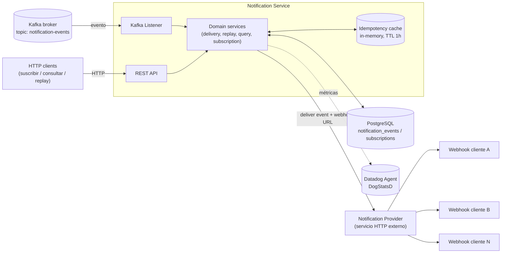
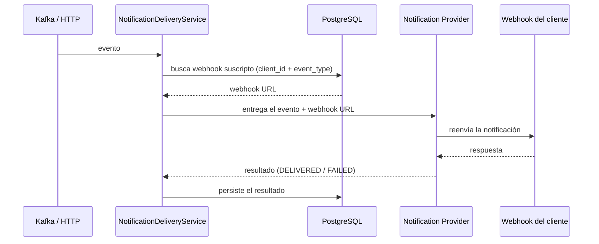

# cobre-challenge — Notification Service

## Stack

- **Java 27** (toolchain fijado en `build.gradle`)
- **Gradle 9.7.1** (via wrapper, `./gradlew`)
- **Spring Boot 4.1.1**, PostgreSQL + Flyway, Spring Kafka, Resilience4j (retry + circuit breaker), Datadog (DogStatsD), SpringDoc OpenAPI

## Descripción

Servicio que consume eventos generados por la plataforma (vía Kafka, o vía HTTP para pruebas), los deduplica, busca si el cliente tiene un webhook suscripto a ese tipo de evento, entrega el evento a través de un **Notification Provider** externo (que reenvía al webhook del cliente), y persiste el resultado de cada intento. Expone además una API de self-service para consultar el historial de eventos por cliente y reintentar (`replay`) los que fallaron.

Arquitectura hexagonal: el dominio (`domain/`) no conoce Kafka, HTTP, Postgres ni Datadog — solo define puertos (`port/in`, `port/out`) que los adaptadores (`adapter/in`, `adapter/out`) implementan.

## Documentación técnica (OpenAPI)

La API REST se documenta automáticamente con **SpringDoc OpenAPI** (`springdoc-openapi-starter-webmvc-ui`), a partir de los controllers y las anotaciones `@Tag` / `@Operation` / `@Parameter` / `@ApiResponse` puestas en `NotificationController` y `SubscriptionController`. Con la app corriendo:

- Spec en JSON: `GET /v3/api-docs`
- UI interactiva (Swagger UI): `GET /swagger-ui.html` (sirve `/swagger-ui/index.html`)

## Arquitectura

- **Kafka**: fuente principal de eventos (`notification.events.topic`). El listener y el endpoint `POST /notification_events` alimentan el mismo caso de uso.
- **PostgreSQL**: `notification_events` (resultado final de cada evento procesado, una fila por `client_id + event_id`) y `subscriptions` (webhook activo por `user_id + event_type`).
- **Idempotency cache**: mapa en memoria (`InMemoryIdempotencyStore`), clave = `event_id`, TTL configurable. Evita reentregar un evento ya delivered dentro de la ventana; el estado durable de "ya entregado" vive en la DB (`delivery_status`), no acá (más detalle en [Idempotencia y Circuit Breaker](#idempotencia-y-circuit-breaker)).
- **Notification Provider**: servicio externo al que le pegamos por HTTP (con retry + circuit breaker); es quien efectivamente llama al webhook del cliente.
- **Datadog**: métricas emitidas vía DogStatsD contra un agente local (ver [Métricas](#métricas)).

## Flujo principal

Camino feliz de un evento (Kafka o `POST /notification_events`): busca el webhook suscripto, entrega la notificación y persiste el resultado.

Antes de este camino, el servicio corta temprano si el evento ya fue entregado (idempotencia) o si no hay webhook suscripto — ver [Idempotencia y Circuit Breaker](#idempotencia-y-circuit-breaker) y la tabla de [otros endpoints](#otros-endpoints) para `replay`.

## Idempotencia y Circuit Breaker

### Idempotencia

Antes de entregar un evento, `NotificationDeliveryService` chequea si ya fue entregado (`IdempotencyPort.isDuplicate`), para no reenviarlo si Kafka lo redelivera o la plataforma lo reenvía. La implementación (`InMemoryIdempotencyStore`) es un mapa en memoria, clave = `event_id` (único a nivel plataforma), con expiración por TTL.

| Property | Qué configura |
|---|---|
| `idempotency.ttl` | Ventana de tiempo durante la cual un `event_id` ya marcado como entregado se considera duplicado. Pasado el TTL, un evento con ese id vuelve a ser elegible para entrega. |

Es una caché en memoria de una sola instancia — no es la fuente de verdad. El estado durable de "ya entregado" es el `delivery_status` persistido en `notification_events`, que es lo que efectivamente evita un doble delivery en el endpoint de `replay`.

### Circuit Breaker (y Retry)

`NotificationProviderHttpClient` envuelve cada llamada al Notification Provider con retry (Resilience4j) y circuit breaker (Resilience4j), para no seguir insistiéndole a un provider caído y para absorber fallas transitorias sin intervención manual.

| Property | Qué configura |
|---|---|
| `notification.provider.path` | Path del Notification Provider al que se hace `POST`. |
| `notification.provider.connect-timeout` | Timeout para establecer la conexión TCP. |
| `notification.provider.read-timeout` | Timeout de lectura de la respuesta una vez conectado. |
| `notification.provider.retry.max-attempts` | Cantidad máxima de intentos (incluye el primero) ante fallas transitorias (5xx, timeout, error de conexión). Un rechazo 4xx **no** se reintenta. |
| `notification.provider.retry.wait-duration` | Espera base entre reintentos. |
| `notification.provider.retry.exponential-backoff-multiplier` | Multiplicador aplicado a `wait-duration` en cada intento sucesivo (con 200ms y multiplicador 2.0: 200ms, 400ms, 800ms...). |
| `notification.provider.circuit-breaker.failure-rate-threshold` | % de llamadas fallidas dentro de la ventana deslizante a partir del cual el circuito se abre (fail-fast, sin llamar al provider). |
| `notification.provider.circuit-breaker.sliding-window-size` | Cantidad de llamadas que componen la ventana deslizante usada para calcular el failure rate. |
| `notification.provider.circuit-breaker.minimum-number-of-calls` | Mínimo de llamadas dentro de la ventana antes de que el circuit breaker empiece a evaluar si abre o no. |
| `notification.provider.circuit-breaker.wait-duration-in-open-state` | Cuánto tiempo el circuito se mantiene abierto (rechazando llamadas sin siquiera intentar) antes de pasar a half-open. |
| `notification.provider.circuit-breaker.permitted-number-of-calls-in-half-open-state` | Cantidad de llamadas de prueba permitidas en half-open para decidir si el circuito cierra de nuevo o vuelve a abrirse. |

Un evento cuya entrega falla definitivamente (reintentos agotados o circuito abierto) queda registrado con `delivery_status=FAILED` y puede reintentarse explícitamente vía `POST /notification_events/{id}/replay`.

## Otros endpoints

| Método | Path | Descripción |
|---|---|---|
| `POST` | `/notification_events` | Ingesta manual de un evento (mismo caso de uso que consume el Kafka listener). Body: `event_id`, `event_type`, `content`, `delivery_date`, `client_id`. |
| `GET` | `/notification_events` | Lista los eventos del cliente indicado en el header `x-user-id`. Filtros opcionales `delivery_status`, `created_from`, `created_to`; paginado con `limit`/`offset` (con topes configurables); ordenado por `delivery_date` descendente. |
| `GET` | `/notification_events/{notification_event_id}` | Detalle de un evento. `400` si el `x-user-id` no coincide con el dueño del evento, `404` si no existe. |
| `POST` | `/notification_events/{notification_event_id}/replay` | Reintenta la entrega. Si ya está `DELIVERED`, es un no-op (no vuelve a llamar al provider). Misma validación de `x-user-id` que el GET por id. |
| `POST` | `/subscriptions` | Crea o actualiza el webhook de un cliente para un tipo de evento. Body: `user_id`, `event_type`, `web_hook_url`. |
| `GET` | `/health` | Liveness check. |

## Métricas

Todas se emiten como counters (vía `MetricsPort`, hoy implementado con Datadog/DogStatsD — ver diagrama de arquitectura). Los tags van en formato `key:value`.

| Métrica | Tags | Qué mide |
|---|---|---|
| `notification.events.received` | `event_type` | Cada evento que entra al flujo de entrega (desde Kafka o HTTP), antes de cualquier chequeo. Volumen total de eventos procesados. |
| `notification.events.duplicate` | `event_type` | Eventos descartados por el chequeo de idempotencia (ya habían sido entregados). Sirve para medir cuántos duplicados llegan. |
| `notification.subscription.webhook_found` | `event_type` | Búsquedas de suscripción que encontraron un webhook activo para ese `client_id` + `event_type`. |
| `notification.subscription.webhook_not_found` | `event_type` | Búsquedas sin suscripción — el evento no se puede entregar (misses de suscripción). |
| `notification.webhook.response` | `status_code`, `event_type` | Cada respuesta del Notification Provider (éxito, rechazo 4xx, error 5xx) o `status_code:timeout` si no hubo respuesta. Permite monitorear la salud de la entrega a los webhooks por código de respuesta. |
| `notification.events.saved` | `delivery_status` | Cada vez que se persiste el resultado final de un evento en la base, agrupado por el estado guardado (`DELIVERED`, `FAILED`, etc). |
